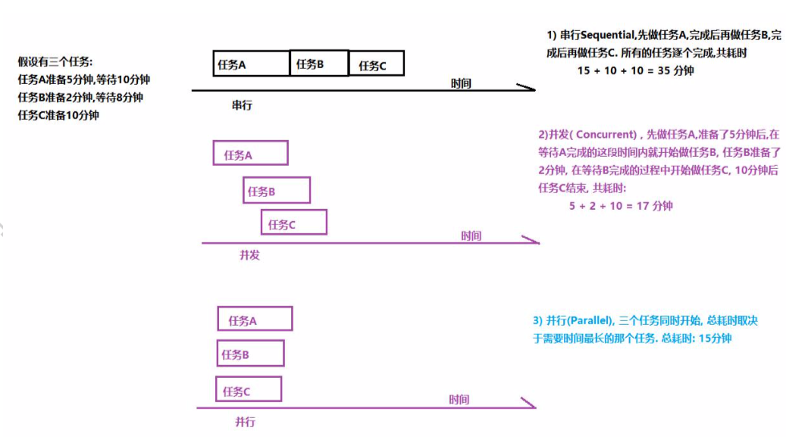

# 								 Java多线程

## 1 线程概述 

### 1.1 线程相关概念

#### 进程

​	进程(Process)是计算机中的程序关于某数据集合上的一次运行活动,是操作系统进行资源分配与调度的基本单位.

​	可以把进程简单的理解为正在操作系统中运行的一个程序. 

#### 线程

​	线程(thread)是进程的一个执行单元.
​	一个线程就是进程中一个单一顺序的控制流, 进程的一个执行分支
​	进程是线程的容器,一个进程至少有一个线程.一个进程中也可以有多个线程.
​	在操作系统中是以进程为单位分配资源,如虚拟存储空间,文件描 述符等. 每个线程都有各自的线程栈,自己的寄存器环境,自己的线程本地存储.

#### 主线程与子线程

​	JVM 启动时会创建一个主线程,该主线程负责执行main方法. 主线程就是运行 main 方法的线程
​	Java 中的线程不孤立的,线程之间存在一些联系. 如果在 A 线程中创建了B线程, 称B线程为A线程的子线程, 相应的A线程就是B线程的父线程

#### 串行,并发与并行



​	并发可以提高以事物的处理效率, 即一段时间内可以处理或者完成更多的事情.
​	并行是一种更为严格,理想的并发
​	从硬件角度来说, 如果单核 CPU,一个处理器一次只能执行一个线程的情况下,处理器可以使用时间片轮转技术 ,可以让 CPU 快速的在 各个线程之间进行切换, 对于用来来说,感觉是三个线程在同时执行. 如果是多核心 CPU,可以为不同的线程分配不同的 CPU 内核.        

### 1.2 线程的创建与启动

​	在 Java 中,创建一个线程就是创建一个 Thread 类(子类)的对象(实例).
​	Thread 类有两个常用的构造方法:Thread()与Thread(Runnable).对应的创建线程的两种方式:
​	定义 Thread 类的子类
​	定义一个 Runnable 接口的实现类

​	这两种创建线程的方式没有本质的区别

```java
package com.horse.createthread.p1;

/**
 * @Description 1)定义类继承 Thread
 * @Author Mr.Horse
 * @Date 2021/2/26
 */
public class MyThread extends Thread{
    //2) 重写 Thread 父类中的 run()
    // run()方法体中的代码就是子线程要执行的任务
    @Override
    public void run() {
        System.out.println("这是子线程需要打印的内容");
    }
}

//---------------------------------------------------------------------------------------

package com.horse.createthread.p1;

/**
 * @Description
 * @Author Mr.Horse
 * @Date 2021/2/26
 */
public class Test {
    public static void main(String[] args) {
        System.out.println("JVM启动main线程,main线程执行main方法");

        //3)创建子线程对象
        MyThread myThread = new MyThread();
        //4)启动线程
        myThread.start();

        /*
            调用线程的start()方法来启动线程, 启动线程的实质就是请求JVM运行相应的线程,这个线程具体在什么时候运行由线程调度器(Scheduler)决定
            注意:
            start()方法调用结束并不意味着子线程开始运行
            新开启的线程会执行run()方法
            如果开启了多个线程,start()调用的顺序并不一定就是线程启动的顺序
                    多线程运行结果与代码执行顺序或调用顺序无关
        */
        System.out.println("main线程后面其他的代码...");
    }
}
```

* Runnable接口

```java
package com.horse.createthread.p2;

/**
 * @Description
 * @Author Mr.Horse
 * @Date 2021/2/26
 */

/**
 * 当线程类已经有父类了,就不能用继承 Thread 类的形式创建线程,可以使用实现 Runnable 接口的形式
 *  1)定义类实现 Runnable 接口
 */
public class MyRunnable implements Runnable{
    //2)重写 Runnable 接口中的抽象方法 run(), run()方法就是子线程要执行的代码
    @Override
    public void run() {
        for(int i=0; i<=1000; i++) {
            System.out.println("sub thread->" + i);
        }
    }
}

//---------------------------------------------------------------------------------------

package com.horse.createthread.p2;

/**
 * @Description
 * @Author Mr.Horse
 * @Date 2021/2/26
 */
public class Test {
    public static void main(String[] args) {
        //3)创建 Runnable 接口的实现类对象
        MyRunnable runnable = new MyRunnable();
        //4)创建线程对象
        Thread thread = new Thread(runnable);
        //5)开启线程
        thread.start();

        //当前是 main 线程
        for(int i=0; i <= 1000; i++) {
            System.out.println("main==>" + i);
        }

        //有时调用 Thread(Runnable)构造方法时,实参也会传递匿名内部类对象
        new Thread(new Runnable() {
            @Override
            public void run() {
                for(int i=0; i<=1000; i++) {
                    System.out.println("sub -------> " + i);
                }
            }
        }).start();
    }
}
```


### 1.3 线程的常用方法 

#### 1.3.1 currentThread()方法

​	Thread.currentThread()方法可以获得当前线程
​	Java中的任何一段代码都是执行在某个线程当中的. 执行当前代码的线程就是当前线程.
​	同一段代码可能被不同的线程执行,因此当前线程是相对 的,Thread.currentThread()方法的返回值是在代码实际运行时候的线程对象。

```java
package com.horse.threadmethod.p1currentmethod;

/**
 * @Description
 * @Author Mr.Horse
 * @Date 2021/2/26
 */

/**
 * 定义线程类
 *      分别在构造方法中和run方法中打印当前线程
 */
public class SubThread1 implements Runnable{

    public SubThread1() {
        System.out.println("构造方法打印当前线程的名称:" + Thread.currentThread().getName());
    }

    @Override
    public void run() {
        System.out.println("run方法打印当前线程名称:" + Thread.currentThread().getName());
    }
}

//---------------------------------------------------------------------------------------

package com.horse.threadmethod.p1currentmethod;

/**
 * @Description 测试当前线程
 * @Author Mr.Horse
 * @Date 2021/2/26
 */
public class Test01CurrentThread {
    public static void main(String[] args) {
        System.out.println("main方法中打印当前线程: " + Thread.currentThread().getName());
        //创建子线程, 调用SubThread1()构造方法, 在main线程中调用构造方法,所以构造方法中的当前线程就是main线程
        Thread subThread = new Thread(new SubThread1());
//        subThread.start();  //启动子线程,子线程会调用run()方法,所以run()方法中的当前线程就是Thread-0子线程
        subThread.run();    //在 main方法中直接调用run()方法,没有开启新的线程,所以在run方法中的当前线程就是main线程

    }
}

//---------------------------------------------------------------------------------------

package com.horse.threadmethod.p1currentmethod;

/**
 * @Description 当前线程的复杂案例
 * @Author Mr.Horse
 * @Date 2021/2/26
 */
public class SubThread2 extends Thread {
    public SubThread2() {
        System.out.println("构造方法中,Thread.currentThread().getname(): " + Thread.currentThread().getName());
        System.out.println("构造方法,this.getName():" + this.getName());
    }

    @Override
    public void run() {
        System.out.println("run方法中,Thread.currentThread().getname(): " + Thread.currentThread().getName());
        System.out.println("run方法,this.getName():" + this.getName());
    }
}

//---------------------------------------------------------------------------------------

package com.horse.threadmethod.p1currentmethod;

/**
 * @Description
 * @Author Mr.Horse
 * @Date 2021/2/26
 */
public class Test02CurrentThread {
    public static void main(String[] args) throws InterruptedException {
        SubThread2 t = new SubThread2();
        t.setName("t1");    //设置当前线程名称
        t.start();

        Thread.sleep(1000);

        //Thread(Runnable)构造方法形参是 Runnable 接口,调用时传递的实参是接口的实现类对象
        Thread t2 = new Thread(t);
        t2.start();

        /**
         * 构造方法中,Thread.currentThread().getname(): main
         * 构造方法,this.getName():Thread-0
         * run方法中,Thread.currentThread().getname(): t1
         * run方法,this.getName():t1
         * run方法中,Thread.currentThread().getname(): Thread-1
         * run方法,this.getName():t1
         */
    }
}
```

#### 1.3.2 setName()/getName()

​	thread.setName(线程名称), 设置线程名称 

​	thread.getName()返回线程名称 

​	通过设置线程名称,有助于程序调试,提高程序的可读性, 建议为每个线程都设置一个能够体现线程功能的名称

#### 1.3.3 isAlive()

​	thread.isAlive()判断当前线程是否处于活动状态 

​	活动状态就是线程已启动并且尚未终止

```java
package com.horse.threadmethod.p2IsAlive;

/**
 * @Description
 * @Author Mr.Horse
 * @Date 2021/2/26
 */
public class SubThread extends Thread{
    @Override
    public void run() {
        System.out.println("run方法.isalive=" + this.isAlive());
    }
}

//---------------------------------------------------------------------------------------

package com.horse.threadmethod.p2IsAlive;

/**
 * @Description 测试当前线程的活动状态
 * @Author Mr.Horse
 * @Date 2021/2/26
 */
public class Test {
    public static void main(String[] args) {
        SubThread subThread = new SubThread();
        System.out.println("begin ==" + subThread.isAlive());   //false,在启动线程之前

        subThread.start();
        System.out.println("end ==" + subThread.isAlive());
        //结果不一定,打印这一行时,如果subThread线程还没结束就返回true,如果subThread线程已结束,就返回false
    }
}

```

####  1.3.4 sleep()

​	Thread.sleep(millis); 让当前线程休眠指定的毫秒数

​	当前线程是指 Thread.currentThread()返回的线程

```java
package com.horse.threadmethod.p3sleep;

/**
 * @Description 子线程休眠
 * @Author Mr.Horse
 * @Date 2021/2/26
 */
public class SubThread extends Thread {

    @Override
    public void run() {
        try {
            System.out.println("run, threadname=" + Thread.currentThread().getName() +
                    ",begin=" + System.currentTimeMillis());

            Thread.sleep(2000); //当前线程睡眠 2000 毫秒

            System.out.println("run, threadname=" + Thread.currentThread().getName() +
                    ",end=" + System.currentTimeMillis());
        }catch (InterruptedException e) {
            //在子线程的run方法中, 如果有受检异常(编译时异常)需要处理,只有选择捕获处理,不能抛出处理
            e.printStackTrace();
        }
    }
}

//---------------------------------------------------------------------------------------

package com.horse.threadmethod.p3sleep;
/**
 * @Description
 * @Author Mr.Horse
 * @Date 2021/2/26
 */
public class Test {
    public static void main(String[] args) {
        SubThread thread = new SubThread();
        System.out.println("main__begin: " + System.currentTimeMillis());

        thread.start();
        /**
         * 返回结果:
         *      main__begin: 1614325531094
         *      main__end: 1614325531095
         *      run, threadname=Thread-0,begin=1614325531095
         *      run, threadname=Thread-0,end=1614325533098
         */

//        thread.run();   //在 main 线程中调用实例方法 run(),没有开启新的线程
        /**
         * 返回结果:
         *      main__begin: 1614325467212
         *      run, threadname=main,begin=1614325467212
         *      run, threadname=main,end=1614325469217
         *      main__end: 1614325469217
         */

        System.out.println("main__end: " + System.currentTimeMillis());
    }
}

//---------------------------------------------------------------------------------------

package com.horse.threadmethod.p3sleep;

/**
 * @Description 使用线程休眠 Thread.sleep 完成一个简易的计时器
 * @Author Mr.Horse
 * @Date 2021/2/26
 */
public class SimpleTimer {
    public static void main(String[] args) {
        int remaining = 10;

        if(args.length == 1) {
            remaining = Integer.parseInt(args[0]);
        }

        while (true) {
            System.out.println("remaining:" + remaining);
            remaining --;
            if(remaining < 0) {
                break;
            }

            try {
                Thread.sleep(1000); //线程休眠
            }catch (InterruptedException e) {
                e.printStackTrace();
            }
        }
        System.out.println("Done");
    }
}
```

#### 1.3.5 getId()

thread.getId()可以获得线程的唯一标识 注意:
某个编号的线程运行结束后,该编号可能被后续创建的线程使 用
重启的 JVM 后,同一个线程的编号可能不一样

```java
package com.horse.threadmethod.p4getid;

/**
 * @Description
 * @Author Mr.Horse
 * @Date 2021/2/26
 */
public class SubThread extends Thread{
    @Override
    public void run() {
        System.out.println("thread.getName()=" + Thread.currentThread().getName() +
                ",id=" + Thread.currentThread().getId());
    }
}

//---------------------------------------------------------------------------------------

package com.horse.threadmethod.p4getid;

/**
 * @Description
 * @Author Mr.Horse
 * @Date 2021/2/26
 */
public class Test {
    public static void main(String[] args) {
        System.out.println(Thread.currentThread().getName() + ",id= " +
                Thread.currentThread().getId());

        //子线程的id
        for(int i=0; i<5; i++) {
            SubThread t = new SubThread();
            t.start();
            try {
                Thread.sleep(100);
            } catch (InterruptedException e) {
                e.printStackTrace();
            }
        }
    }
}
```


#### 1.3.6 yield()

​	Thread.yield()方法的作用是放弃当前的 CPU 资源,

```java
package com.horse.threadmethod.p5yield;

/**
 * @Description 线程让步
 * @Author Mr.Horse
 * @Date 2021/2/26
 */
public class SubThread extends Thread{
    @Override
    public void run() {
        long begin = System.currentTimeMillis();
        long sum = 0;
        for(int i = 0; i < 10000000; i++) {
            sum += i;
            Thread.yield();     //线程让步,放弃CPU执行权
        }

        long end = System.currentTimeMillis();
        System.out.println("用时:" + (end - begin));

    }
}

//---------------------------------------------------------------------------------------

package com.horse.threadmethod.p5yield;

/**
 * @Description
 * @Author Mr.Horse
 * @Date 2021/3/1
 */
public class Test {
    public static void main(String[] args) {
        //开启子线程,计算累加和
        SubThread thread = new SubThread();
        thread.start();

        //在 main 线程中计算累加和
        long begin = System.currentTimeMillis();
        long sum = 0;
        for(int i = 0; i < 10000000; i++) {
            sum += i;
            Thread.yield();     //线程让步,放弃CPU执行权
        }

        long end = System.currentTimeMillis();
        System.out.println("main线程用时:" + (end - begin));
    }
}
```


#### 1.3.7 setPriority()

​	**thread.setPriority(num); 设置线程的优先级**
​	java 线程的优先级取值范围是 1 ~ 10 , 如果超出这个范围会抛出 异常 IllegalArgumentException.
​	在操作系统中,优先级较高的线程获得 CPU 的资源越多
​	线程优先级本质上是只是给线程调度器一个提示信息,以便于调 度器决定先调度哪些线程. 注意不能保证优先级高的线程先运行.

​	Java 优先级设置不当或者滥用可能会导致某些线程永远无法得到 运行,即产生了线程饥饿.
​	线程的优先级并不是设置的越高越好,一般情况下使用普通的优 先级即可,即在开发时不必设置线程的优先级
​	线程的优先级具有继承性, 在 A 线程中创建了 B 线程,则 B 线程的 优先级与 A 线程是一样的.

```java
package com.horse.threadmethod.p6priority;

/**
 * @Description
 * @Author Mr.Horse
 * @Date 2021/3/1
 */
public class ThreadA extends Thread {
    @Override
    public void run() {
        long begin = System.currentTimeMillis(); long sum = 0 ;
        for(long i = 0 ; i<= 10000000000L; i++){
            sum += i; }
        long end = System.currentTimeMillis();
        System.out.println("thread a : " + (end - begin));
    }
}

//---------------------------------------------------------------------------------------

package com.horse.threadmethod.p6priority;

/**
 * @Description
 * @Author Mr.Horse
 * @Date 2021/3/1
 */
public class ThreadB extends Thread {
    @Override
    public void run() {
        long begin = System.currentTimeMillis(); long sum = 0 ;
        for(long i = 0 ; i<= 10000000000L; i++){
            sum += i; }
        long end = System.currentTimeMillis();
        System.out.println("thread b : " + (end - begin));
    }
}

//---------------------------------------------------------------------------------------

package com.horse.threadmethod.p6priority;

/**
 * @Description
 * @Author Mr.Horse
 * @Date 2021/3/1
 */
public class Test {
    public static void main(String[] args) {
        ThreadA threadA = new ThreadA();
        threadA.setPriority(1);
        threadA.start();

        ThreadB threadB = new ThreadB();
        threadB.setPriority(10);
        threadB.start();
    }
}

```

#### 1.3.8 interrupt()

​	中断线程.
​	注意调用 interrupt()方法仅仅是在当前线程打一个停止标志,并不是真正的停止线程

```java
package com.horse.threadmethod.p7interrupt;

/**
 * @Description
 * @Author Mr.Horse
 * @Date 2021/3/1
 */
public class SubThread extends Thread {
    @Override
    public void run() {
        for(int i=0; i<10000; i++) {
            //判断线程的中断标志,线程有 isInterrupted()方法,该 方法返回线程的中断标志
            if(this.isInterrupted()) {
//                break;
                return; //结束当前循环
            }

            System.out.println("sub-->" + i);
        }
    }
}

//---------------------------------------------------------------------------------------

package com.horse.threadmethod.p7interrupt;

/**
 * @Description
 * @Author Mr.Horse
 * @Date 2021/3/1
 */
public class Test {
    public static void main(String[] args) {
        SubThread thread = new SubThread();
        thread.start(); //开启子线程

        //当前线程是 main 线程
        for(int i = 0; i < 100; i++) {
            System.out.println("main run ==> " + i);
        }

        //中断子线程,但是仅仅是给子线程标记中断
        thread.interrupt();
    }
}
```


#### 1.3.9 setDaemon()

​	Java 中的线程分为用户线程与守护线程
​	守护线程是为其他线程提供服务的线程,如垃圾回收器(GC)就是一 个典型的守护线程
​	守护线程不能单独运行, 当JVM中没有其他用户线程,只有守护线程时,守护线程会自动销毁, JVM 会退出

```java
package com.horse.threadmethod.p8daemon;

/**
 * @Description
 * @Author Mr.Horse
 * @Date 2021/3/1
 */
public class SubThread extends Thread {
    @Override
    public void run() {
        while(true) {
            System.out.println("sub Thread...");
        }
    }
}

//---------------------------------------------------------------------------------------

package com.horse.threadmethod.p8daemon;

/**
 * @Description
 * @Author Mr.Horse
 * @Date 2021/3/1
 */
public class Test {
    public static void main(String[] args) {
        SubThread thread = new SubThread();
        //设置线程为守护线程
        thread.setDaemon(true); //设置守护线程的代码应该在线程启动之前
        thread.start();

        //当前线程为main线程
        for(int i=0; i<=10; i++) {
            System.out.println("main==>" + i);
        }
        //当main线程结束, 守护线程thread也销毁了
    }
}
```


#### 1.4 线程的生命周期

​	线程的生命周期是线程对象的生老病死,即线程的状态
​	线程生命周期可以通过 getState()方法获得, 线程的状态是 

​	**Thread.State 枚举类型定义的, 由以下几种:**

* NEW,新建状态. 创建了线程对象,在调用 start()启动之前的状态
* RUNNABLE,可运行状态. 它是一个复合状态,包含:READY和RUNNING 两个状态. READY 状态该线程可以被线程调度器进行调度使 它处于 RUNNING 状态, RUNING 状态表示该线程正在执行. Thread.yield()方法可以把线程由 RUNNING 状态转换为 READY 状态
* BLOCKED 阻塞状态.线程发起阻塞的 I/O 操作,或者申请由其他线程 占用的独占资源,线程会转换BLOCKED 阻塞状态. 处于阻塞状态的线程不会占用CPU资源. 当阻塞I/O操作执行完,或者线程获得了其申请的资源,线程可以转换为 RUNNABLE.
* WAITING 等待状态. 线程执行了 object.wait(), thread.join()方法会把线程转换为WAITING等待状态, 执行 object.notify()方法,或者加入的线程执行完毕,当前线程会转换为 RUNNABLE 状态
* TIMED_WAITING 状态,与WAITING状态类似,都是等待状态.区别在于处于该状态的线程不会无限的等待,如果线程没有在指定的时间范围内完成期望的操作,该线程自动转换为 RUNNABLE
* TERMINATED终止状态,线程结束处于终止状态
          


### 1.5 多线程编程的优势与存在的风险

**多线程编程具有以下优势:**
	1) 提高系统的吞吐率(Throughout). 多线程编程可以使一个进程，有多个并发(concurrent,即同时进行的)的操作
	2) 提高响应性(Responsiveness).Web 服务器会采用一些专门的线程负责用户的请求处理,缩短了用户的等待时间
	3) 充分利用多核(Multicore)处理器资源. 通过多线程可以充分的利用 CPU 资源

**多线程编程存在的问题与风险:**
	1) 线程安全(Thread safe)问题.多线程共享数据时,如果没有采取正确的并发访问控制措施,就可能会产生数据一致性问题,如读取脏数 据(过期的数据), 如丢失数据更新.
	2) 线程活性(thread liveness)问题.由于程序自身的缺陷或者由资 源稀缺性导致线程一直处于非 RUNNABLE 状态,这就是线程活性问题, 常见的活性故障有以下几种:
		(1) 死锁(Deadlock). 类似鹬蚌相争.
		(2) 锁死(Lockout), 类似于睡美人故事中王子挂了
		(3) 活锁(Livelock). 类似于小猫咬自己尾巴
		(4) 饥饿(Starvation).类似于健壮的雏鸟总是从母鸟嘴中抢到食物.
	3) 上下文切换(Context Switch). 处理器从执行一个线程切换到执行另外一个线程
	4) 可靠性. 可能会由一个线程导致 JVM 意外终止,其他的线程也无法执行.


## 2 线程安全问题

​	非线程安全主要是指多个线程对同一个对象的实例变量进行操作时,会出现值被更改,值不同步的情况.
​	线程安全问题表现为三个方面: 原子性,可见性和有序性

### 2.1 原子性

​	原子(Atomic)就是不可分割的意思.原子操作的不可分割有两层含义:
​	1) 访问(读,写)某个共享变量的操作从其他线程来看,该操作要么已经执行完毕,要么尚未发生, 即其他线程访问到当前操作的中间结果
​	2) 访问同一组共享变量的原子操作是不能够交错的
​	如现实生活中从 ATM 机取款, 对于用户来说,要么操作成功,用户拿到钱, 余额减少了,增加了一条交易记录; 要么没拿到钱,相当于取款操作没有发生

 	Java 有两种方式实现原子性: 一种是使用锁; 另一种利用处理器的CAS(Compare and Swap)指令.
 	锁具有排它性,保证共享变量在某一时刻只能被一个线程访问. CAS 指令直接在硬件(处理器和内存)层次上实现,看作是硬件锁

### 2.2 可见性

​	在多线程环境中, 一个线程对某个共享变量进行更新之后 , 后续其他的线程可能无法立即读到这个更新的结果, 这就是线程安全问题的另外一种形式: 可见性(visibility).
​	如果一个线程对共享变量更新后, 后续访问该变量的其他线程可以读到更新的结果, 称这个线程对共享变量的更新对其他线程可见, 否则称这个线程对共享变量的更新对其他线程不可见.
​	多线程程序因为可见性问题可能会导致其他线程读取到了旧数据 (脏数据).

### 2.3 有序性

​	有序性(Ordering)是指在什么情况下一个处理器上运行的一个线程所执行的内存访问操作在另外一个处理器运行的其他线程看来是乱序的(Out of Order).

   乱序是指内存访问操作的顺序看起来发生了变化

#### 2.3.1 重排序

​	在多核处理器的环境下,编写的顺序结构,这种操作执行的顺序可能是没有保障的:
​	编译器可能会改变两个操作的先后顺序; 

​	处理器也可能不会按照目标代码的顺序执行; 

​	这种一个处理器上执行的多个操作,在其他处理器来看它的顺序与目标代码指定的顺序可能不一样,这种现象称为重排序. 

​	重排序是对内存访问有序操作的一种优化,可以在不影响单线程程序正确的情况下提升程序的性能.但是,可能 对多线程程序的正确性产生影响,即可能导致线程安全问题。 

​	重排序与可见性问题类似,不是必然出现的.

**与内存操作顺序有关的几个概念:**

- 源代码顺序, 就是源码中指定的内存访问顺序.
- 程序顺序, 处理器上运行的目标代码所指定的内存访问顺序 
- 执行顺序,内存访问操作在处理器上的实际执行顺序 
- 感知顺序,给定处理器所感知到的该处理器及其他处理器的内存

**访问操作的顺序**

  可以把重排序分为**指令重排序**与**存储子系统重排序**两种.
**指令重排序**主要是由 JIT编译器,处理器引起的, 指程序顺序与执行顺序不一样
**存储子系统重排序**是由高速缓存,写缓冲器引起的, 感知顺序与执行顺序不一致

#### 2.3.2 指令重排序

​	在源码顺序与程序顺序不一致,或者程序顺序与执行顺序不一致的情况下,我们就说发生了指令重排序(Instruction Reorder).
​	指令重排是一种动作,确实对指令的顺序做了调整, 重排序的对象指令.
​	javac 编译器一般不会执行指令重排序, 而JIT编译器可能执行指令重排序.
​	处理器也可能执行指令重排序, 使得执行顺序与程序顺序不一致. 指令重排不会对单线程程序的结果正确性产生影响,可能导致多线程程序出现非预期的结果.
​         

#### 2.3.3 存储子系统重排序

​	存储子系统是指写缓冲器与高速缓存.

* 高速缓存(Cache)是CPU中为了匹配与主内存处理速度不匹配而设计的一个高速缓存

* 写缓冲器(Store buffer, Write buffer)用来提高写高速缓存操作的效率
  	

即使处理器严格按照程序顺序执行两个内存访问操作,在存储子系统的作用下, 其他处理器对这两个操作的感知顺序与程序顺序不 一致,即这两个操作的顺序顺序看起来像是发生了变化, 这种现象称为**存储子系统重排序**

存储子系统重排序并没有真正的对指令执行顺序进行调整,而是造成一种指令执行顺序被调整的现象.

存储子系统重排序对象是内存操作的结果.
	

从处理器角度来看, 读内存就是从指定的RAM地址中加载数据到寄存器,称为 Load 操作; 写内存就是把数据存储到指定的地址表示 的 RAM 存储单元中,称为 Store 操作.**内存重排序有以下四种可能:**

* LoadLoad 重排序,一个处理器先后执行两个读操作 L1 和 L2,其他处理器对两个内存操作的感知顺序可能是 L2->L1

* StoreStore 重排序,一个处理器先后执行两个写操作 W1 和 W2,其他处理器对两个内存操作的感知顺序可能是 W2->W1

* LoadStore 重排序,一个处理器先执行读内存操作 L1 再执行写内存操作 W1, 其他处理器对两个内存操作的感知顺序可能是 W1->L1 

* StoreLoad 重排序,一个处理器先执行写内存操作 W1 再执行读内存操作 L1, 其他处理器对两个内存操作的感知顺序可能是 L1->W1 

  

  内存重排序与具体的处理器微架构有关,不同架构的处理器所允许的内存重排序不同

  内存重排序可能会导致线程安全问题.假设有两个共享变量 int data = 0; boolean ready = false;

  | 处理器1                                 | 处理器2                                        |
  | --------------------------------------- | ---------------------------------------------- |
  | data = 1; //S1 <br />ready = true; //S2 |                                                |
  |                                         | while( !ready){} //L3 <br />sout( data ); //L4 |

  ​      

#### 2.3.4 貌似串行语义

​	JIT 编译器,处理器,存储子系统是按照一定的规则对指令,内存操作的结果进行重排序, 给单线程程序造成一种假象----指令是按照源码 的顺序执行的.这种假象称为貌似串行语义. 并不能保证多线程环境程序的正确性

 	为了保证貌似串行语义,有数据依赖关系的语句不会被重排序,只 有不存在数据依赖关系的语句才会被重排序.如果两个操作(指令)访 问同一个变量,且其中一个操作(指令)为写操作,那么这两个操作之间 就存在数据依赖关系(Data dependency).     

​	如:
​		x = 1;  y=x+1;后一条语句的操作数包含前一条语句的执行结果；
​		y = x; x = 1;先读取 x 变量,再更新 x 变量的值;

​		x = 1; x = 2; 两条语句同时对一个变量进行写操作

   

​	如果不存在数据依赖关系则可能重排序,如: 

```
double price = 45.8;
int quantity = 10;
double sum = price * quantity;
```

​	存在控制依赖关系的语句允许重排.一条语句(指令)的执行结果会决定另一条语句(指令)能否被执行,这两条语句(指令)存在控制依赖关系(Control Dependency). 如在 if 语句中允许重排,可能存在处理器先执行if代码块,再判断 if条件是否成立

#### 2.3.5 保证内存访问的顺序性

​	可以使用 volatile 关键字, synchronized 关键字实现有序性

### 2.4 Java 内存模型


## 3 线程同步

### 3.1 线程同步机制简介

​	线程同步机制是一套用于协调线程之间的数据访问的机制.该机制可以保障线程安全.
​	Java 平台提供的线程同步机制包括: 锁, volatile 关键字, final 关键 字,static 关键字,以及相关的 API,如 Object.wait()/Object.notify()等

### 3.2 锁概述

​	线程安全问题的产生前提是多个线程并发访问共享数据.
​	将多个线程对共享数据的并发访问转换为串行访问,即一个共享数据一次只能被一个线程访问.锁就是复用这种思路来保障线程安全的
​	锁(Lock)可以理解为对共享数据进行保护的一个许可证. 对于同一个许可证保护的共享数据来说,任何线程想要访问这些共享数据必须先持有该许可证. 一个线程只有在持有许可证的情况下才能对这些共享数据进行访问; 并且一个许可证一次只能被一个线程持有; 许可证线程在结束对共享数据的访问后必须释放其持有的许可证.

​	一线程在访问共享数据前必须先获得锁; 获得锁的线程称为锁的持有线程; 一个锁一次只能被一个线程持有. 锁的持有线程在获得锁之后和释放锁之前这段时间所执行的代码称为临界区(Critical Section).

​	锁具有排他性(Exclusive), 即一个锁一次只能被一个线程持有.这 种锁称为排它锁或互斥锁(Mutex).


​	JVM把锁分为内部锁和显示锁两种. 内部锁通过 synchronized 关键字实现; 显示锁通过 java.concurrent.locks.Lock接口的实现类实现的

#### 3.2.1 锁的作用

​	锁可以实现对共享数据的安全访问. 保障线程的原子性,可见性与有序性.
​	锁是通过互斥保障原子性. 一个锁只能被一个线程持有, 这就保证临界区的代码一次只能被一个线程执行.使得临界区代码所执行的 操作自然而然的具有不可分割的特性,即具备了原子性.

​	可见性的保障是通过写线程冲刷处理器的缓存和读线程刷新处理器缓存这两个动作实现的. 在java平台中,锁的获得隐含着刷新处理器缓存的动作, 锁的释放隐含着冲刷处理器缓存的动作.
​	锁能够保障有序性.写线程在临界区所执行的在读线程所执行的临界区看来像是完全按照源码顺序执行的.
注意: 使用锁保障线程的安全性,必须满足以下条件:
​    这些线程在访问共享数据时必须使用同一个锁
​    即使是读取共享数据的线程也需要使用同步锁

#### 3.2.2 锁相关的概念 

##### 1)可重入性

可重入性(Reentrancy)描述这样一个问题: 一个线程持有该锁的时候能再次(多次)申请该锁

```markdown
void methodA(){ 
	申请 a 锁
	methodB();
	释放 a 锁 
}

void methodB(){ 
	申请 a 锁
	....
	释放 a 锁 
}           
```

  如果一个线程持有一个锁的时候还能够继续成功申请该锁,称该锁是可重入的, 否则就称该锁为不可重入的

##### 2)锁的争用与调度

​	Java平台中内部锁属于非公平锁, 显示Lock锁既支持公平锁又支持非公平锁

##### 3)锁的粒度

​	一个锁可以保护的共享数据的数量大小称为锁的粒度. 

​	锁保护共享数据量大,称该锁的粒度粗, 否则就称该锁的粒度细. 

​	锁的粒度过粗会导致线程在申请锁时会进行不必要的等待.锁的粒度过细会增加锁调度的开销.

### 3.3 内部锁:synchronized 关键字

​	Java 中的每个对象都有一个与之关联的内部锁(Intrinsic lock). 这种锁也称为监视器(Monitor), 这种内部锁是一种排他锁,可以保障原子性,可见性与有序性.
​	内部锁是通过synchronized关键字实现的.synchronized关键字修饰代码块,修饰该方法.

​	修饰代码块的语法: 

```markdown
synchronized(对象锁) {
			同步代码块,可以在同步代码块中访问共享数据 
}
```

 	修饰实例方法就称为同步实例方法
 	修饰静态方法称称为同步静态方法

#### 3.3.1 synchronized 同步代码块

```java
package com.horse.ch03intrinsiclock;

/**
 * @Description synchronized 同步代码块
 *              this 锁对象
 * @Author Mr.Horse
 * @Date 2021/3/4
 */
public class Test01 {
    public static void main(String[] args) {
        //创建两个线程,分别调用 mm()方法
        //先创建 Test01 对象,通过对象名调用 mm()方法
        Test01 obj = new Test01();

        new Thread(new Runnable() {
            @Override
            public void run() {
                obj.mm();
            }
        }).start();


        new Thread(() -> obj.mm()).start();
    }

    //定义方法,打印100行字符串
    public void mm() {
        synchronized (this) {
            //经常使用this当前对象作为锁对象
            for(int i = 1; i <= 100; i++) {
                System.out.println(Thread.currentThread().getName() + "-->" + i);
            }
        }
    }
}

//---------------------------------------------------------------------------------------

package com.horse.ch03intrinsiclock;

/**
 * @Description synchronized同步代码块
 *              如果线程的锁不同,不能实现同步
 *              想要同步必须使用同一个锁对象
 * @Author Mr.Horse
 * @Date 2021/3/4
 */
public class Test02 {
    public static void main(String[] args) {
        //创建两个线程,分别调用 mm()方法
        //先创建 Test01 对象,通过对象名调用 mm()方法
        Test01 obj = new Test01();
        Test02 obj2 = new Test02();

        new Thread(new Runnable() {
            @Override
            public void run() {
                obj.mm();
            }
        }).start();

        new Thread(new Runnable() {
            @Override
            public void run() {
                obj2.mm();
            }
        }).start();
    }

    //定义方法,打印 100 行字符串
    public void mm() {
        synchronized(this) {
            //经常使用this当前对象作为锁对象
            for(int i = 1; i <= 100; i++) {
                System.out.println(Thread.currentThread().getName() + "-->" + i);
            }
        }
    }
}

//---------------------------------------------------------------------------------------

package com.horse.ch03intrinsiclock;

/**
 * @Description synchronized 同步代码块
 *              使用一个常量对象作为锁对象
 * @Author Mr.Horse
 * @Date 2021/3/4
 */
public class Test03 {
    public static void main(String[] args) {
        //创建两个线程,分别调用 mm()方法
        //先创建 Test01 对象,通过对象名调用 mm()方法
        Test03 obj = new Test03();
        Test03 obj2 = new Test03();

        new Thread(new Runnable() {
            @Override
            public void run() {
                obj.mm();
            }
        }).start();

        new Thread(() -> obj2.mm()).start();

    }

    public static final Object OBJ = new Object();
    public void mm() {
        synchronized (OBJ) {
            //使用一个常量对象作为锁对象
            for (int i = 1; i <= 100; i++) {
                System.out.println(Thread.currentThread().getName() + " --> " + i); }
        }
    }
}

//---------------------------------------------------------------------------------------

package com.horse.ch03intrinsiclock;

/**
 * @Description synchronized 同步代码块
 *              使用一个常量对象作为锁对象,不同方法中的同步代码块也可以同步
 * @Author Mr.Horse
 * @Date 2021/3/4
 */
public class Test04 {
    public static void main(String[] args) {
        //创建两个线程,分别调用 mm()方法
        //先创建 Test01 对象,通过对象名调用 mm()方法
        Test04 obj = new Test04();
        Test04 obj2 = new Test04();

        new Thread(new Runnable() {
            @Override
            public void run() {
                obj.mm();
            }
        }).start();

        new Thread(new Runnable() {
            @Override
            public void run() {
                obj2.mm();
            }
        }).start();

        //第三个线程调用静态方法
        new Thread(() -> sm()).start();

    }

    public static final Object OBJ = new Object();

    //定义方法,打印 100 行字符串
    public void mm() {
        synchronized (OBJ){
            //使用一个常量对象作为锁对象
            for(int i = 1; i <= 100; i++) {
                System.out.println(Thread.currentThread().getName() + " --> " + i);
            }
        }
    }

    //定义方法,打印 100 行字符串
    public static void sm() {
        synchronized (OBJ) {
            for(int i = 1; i <= 100; i++) {
                System.out.println(Thread.currentThread().getName() + " --> " + i);
            }
        }
    }
}
```

* Synchronized代码执行过程


#### 3.3.2 同步方法

```java
package com.horse.ch03intrinsiclock;

/**
 * @Description synchronized 同步实例方法
 *                  把整个方法体作为同步代码块
 *                  默认的锁对象是 this 对象
 * @Author Mr.Horse
 * @Date 2021/3/6
 */
public class Test05 {
    public static void main(String[] args) {
        //先创建 Test05 对象,通过对象名调用 mm()方法
        Test05 obj = new Test05();

        //一个线程调用 mm()方法
        new Thread(new Runnable() {
            @Override
            public void run() {
                obj.mm();
            }
        }).start();

        //另一个线程调用 mm22()方法
        new Thread(new Runnable() {
            @Override
            public void run() {
                obj.mm2();  //使用的锁对象this也是obj对象,可以同步
//                new Test05().mm2(); //使用的锁对象 this 是刚刚 new 创建的一个新对象,不是同一个锁对象不能同步
            }
        }).start();
    }

    //定义方法,打印 100 行字符串
    public void mm() {
        synchronized(this) {
            //经常使用this作为锁对象
            for(int i=1; i<=100; i++) {
                System.out.println(Thread.currentThread().getName() + "-->" + i);
            }
        }
    }

    //使用 synchronized 修饰实例方法,同步实例方法, 默认 this 作为锁对象
    public synchronized void mm2() {
        for(int i=1; i<=100; i++) {
            System.out.println(Thread.currentThread().getName() + "-->" + i);
        }
    }
}

//---------------------------------------------------------------------------------------

package com.horse.ch03intrinsiclock;

/**
 * @Description synchronized 同步静态方法
 *                  把整个方法体作为同步代码块
 *                  默认的锁对象是当前类的运行时类对象,Test06.class,有人称它为类锁
 * @Author Mr.Horse
 * @Date 2021/3/6
 */
public class Test06 {
    public static void main(String[] args) {
        //先创建 Test06 对象,通过对象名调用 mm()方法
        Test06 obj = new Test06();
        //一个线程调用 m1()方法
        new Thread(new Runnable() {
            @Override
            public void run() {
                obj.m1();   //使用的锁对象是 Test06.class
            }
        }).start();

        //另一个线程调用 m2()方法
        new Thread(new Runnable() {
            @Override
            public void run() {
                Test06.m2();    //使用的锁对象是 Test06.class
            }
        }).start();
    }

    //定义方法,打印 100 行字符串
    public void m1() {
        //使用当前类的运行时类对象作为锁对象,可以简单的理解为把 Test06 类的字节码文件作为锁对象
        synchronized(Test06.class) {
            for(int i=1; i<=100; i++) {
                System.out.println(Thread.currentThread().getName() + "->" + i);
            }
        }
    }

    //使用 synchronized 修饰静态方法,同步静态方法, 默认运行时类 Test06.class 作为锁对象
    public synchronized static void m2() {
        for(int i=1; i<=100; i++) {
            System.out.println(Thread.currentThread().getName() + "->" + i);
        }
    }
}

//---------------------------------------------------------------------------------------

package com.horse.ch03intrinsiclock;

/**
 * @Description 同步方法与同步代码块如何选择
 *              同步方法锁的粒度粗, 执行效率低, 同步代码块执行效率高
 * @Author Mr.Horse
 * @Date 2021/3/6
 */
public class Test07 {
    public static void main(String[] args) {
        Test07 obj = new Test07();
        new Thread(new Runnable() {
            @Override
            public void run() {
                obj.doLongTimeTask();
            }
        }).start();

        new Thread(() -> obj.doLongTimeTask2()).start();
    }

    //同步方法, 执行效率低
    public synchronized void doLongTimeTask() {
        try {
            System.out.println("Task Begin");
            Thread.sleep(3000); //模拟任务需要准备 3 秒

            System.out.println("开始同步");
            for(int i=1; i<=100; i++) {
                System.out.println(Thread.currentThread().getName() + "->" + i);
            }

            System.out.println("Task End");

        }catch (InterruptedException e) {
            e.printStackTrace();
        }
    }

    //同步代码块,锁的粒度细, 执行效率高
    public void doLongTimeTask2() {
        try {
            System.out.println("Task Begin");
            Thread.sleep(3000); //模拟任务需要准备 3 秒
            synchronized (this) {
                System.out.println("开始同步");
                for(int i=1; i<=100; i++) {
                    System.out.println(Thread.currentThread().getName() + "->" + i);
                }
            }
            System.out.println("Task End");
        } catch (InterruptedException e) {
            e.printStackTrace();
        }
    }
}
```


#### 3.3.3 脏读

```java
package com.horse.ch03intrinsiclock;

/**
 * @Description 脏读:
 *                 出现读取属性值出现了一些意外, 读取的是中间值,而不是修改之后的值
 *                 出现脏读的原因是: 对共享数据的修改与对共享数据的读取不同步
 *                 解决方法:不仅对修改数据的代码块进行同步,还要对读取数据的代码块同步
 * @Author Mr.Horse
 * @Date 2021/3/6
 */

public class Test08 {
    public static void main(String[] args) throws InterruptedException {
        //开启子线程设置用户名和密码
        PublicValue publicValue = new PublicValue();
        SubThread thread = new SubThread(publicValue);

        thread.start();

        //为了确定设置成功
        Thread.sleep(100);
        //在 main 线程中读取用户名,密码
        publicValue.getValue();

    }

    //定义线程,设置用户名和密码
    public static class SubThread extends Thread {
        private PublicValue publicValue;

        public SubThread(PublicValue publicValue) {
            this.publicValue = publicValue;
        }

        @Override
        public void run() {
            publicValue.setValue("wangwu", "wangwu");
        }
    }

    static class PublicValue {
        private String name = "Horse";
        private String pwd = "Horse";

        public /*synchronized*/ void getValue() {
            System.out.println(Thread.currentThread().getName() + ",getter--name:" + name + ",getter--pwd:" + pwd);
        }

        public synchronized void setValue(String name, String pwd) {
            this.name = name;
            try {
                Thread.sleep(1000); // 模拟操作name属性需要一段时间

            }catch (InterruptedException e) {
                e.printStackTrace();
            }
            this.pwd = pwd;
            System.out.println(Thread.currentThread().getName() + ",getter--name:" + name + ",getter--pwd:" + pwd);
        }
    }
}
```


#### 3.3.4 线程出现异常会自动释放锁

```java
package com.horse.ch03intrinsiclock;

/**
 * @Description 同步过程中线程出现异常,会自动释放锁对象
 * @Author Mr.Horse
 * @Date 2021/3/6
 */
public class Test09 {
    public static void main(String[] args) {
        Test09 obj = new Test09();
        new Thread(() -> obj.m1()).start();
        new Thread(() -> Test09.m2()).start();
    }

    public void m1() {
        synchronized (Test09.class) {
            for(int i=1; i<=100; i++) {
                System.out.println(Thread.currentThread().getName() + "->" + i);

                if(i == 50) {
                    int a = Integer.parseInt("abc");//把字符串转换为 int 类型时,如果字符串不符合 数字格式会产生异常
                }
            }
        }
    }

    //使用 synchronized 修饰静态方法,同步静态方法, 默认运行时类 Test06.class 作为锁对象
    public static synchronized void m2() {
        for(int i=1; i<=100; i++) {
            System.out.println(Thread.currentThread().getName() + "->" + i);
        }
    }
}
```

 

#### 3.3.5 死锁

```java
package com.horse.ch03intrinsiclock;

/**
 * @Description 死锁
 *                  在多线程程序中,同步时可能需要使用多个锁,如果获得锁的顺序不一致,可能会导致死锁
 *              如何避免死锁?
 *                  当需要获得多个锁时,所有线程获得锁的顺序保持一致即可
 * @Author Mr.Horse
 * @Date 2021/3/6
 */
public class Test10 {
    public static void main(String[] args) {
        SubThread t1 = new SubThread();
        t1.setName("a");
        t1.start();

        SubThread t2 = new SubThread();
        t2.setName("b");
        t2.start();

    }

    static class SubThread extends Thread {
        private static Object lock1 = new Object();
        private static Object lock2 = new Object();

        @Override
        public void run() {
            if("a".equals(Thread.currentThread().getName())) {
                synchronized (lock1) {
                    System.out.println("a线程获取lock1锁,还需要获取lock2锁");
                    synchronized (lock2) {
                        System.out.println("a线程又获得了lock2,可以想干任何想干的事");
                    }
                }
            }

            if("b".equals(Thread.currentThread().getName())) {
                synchronized (lock2) {
                    System.out.println("b线程获取lock2锁,还需要获取lock1锁");
                    synchronized (lock1) {
                        System.out.println("b线程又获得了lock1,可以想干任何想干的事");
                    }
                }
            }
        }
    }
}
```


### 3.4 轻量级同步机制:volative 关键字 

#### 3.4.1 volatile 的作用

volatile 关键的作用使变量在多个线程之间可见.

```java
package com.horse.ch04volatilekw;

/**
 * @Description volatile的作用可以强制线程从公共内存中读取变量的值,而不是从工作内存中读取
 * @Author Mr.Horse
 * @Date 2021/3/6
 */
public class Test01 {
    public static void main(String[] args) throws InterruptedException {
        //创建 PrintString 对象
        PrintString printString = new PrintString();

        //创建 PrintString 对象
        new Thread(new Runnable() {
            @Override
            public void run() {
                printString.printMethod();
            }
        }).start();

        Thread.sleep(1000);

        /**
         * 程序运行,查看在 main 线程中修改了打印标志之后 ,子线程打印是否可以结束打印
         * 程序运行后, 可能会出现死循环情况
         * 分析原因: main 线程修改了 printString 对象的打印标志后, 子线程读不到
         * 解决办法: 使用 volatile 关键字修饰 printString 对象的打印标志.
         *      volatile 的作用可以强制线程从公共内存中读取变量的值,而不是从工作内存中读取
         */

        System.out.println("在main线程中打印标志");
        printString.setContinuePrint(false);
    }

    //定义类打印字符串
    static class PrintString {
        private volatile boolean continuePrint = true;

        public PrintString setContinuePrint(boolean continuePrint) {
            this.continuePrint = continuePrint;
            return this;
        }

        public void printMethod() {
            System.out.println(Thread.currentThread().getName() + "开始...");
            while(continuePrint) {

            }

            System.out.println(Thread.currentThread().getName() + "结束...");
        }

    }
}
```

#####  volatile 与 synchronized 比较

1. volatile 关键字是线程同步的轻量级实现,所以 volatile 性能肯定 比 synchronized 要好; volatile 只能修饰变量,而 synchronized 可以修饰方法,代码块. 随着 JDK 新版本的发布,synchronized 的执行效率也有较大的提升,在开发中使用 sychronized 的比率还是很大的.
2. 多线程访问 volatile 变量不会发生阻塞,而 synchronized 可能会阻塞
3. volatile 能保证数据的可见性,但是不能保证原子性; 而 synchronized 可以保证原子性,也可以保证可见性
4. 关键字 volatile 解决的是变量在多个线程之间的可见性;synchronized 关键字解决多个线程之间访问公共资源的同步性. 

#### 3.4.2 volatile 非原子特性

volatile 关键字增加了实例变量在多个 线程之间的可见性,但是不具备原子性.

```java
package com.horse.ch04volatilekw;

/**
 * @Description  volatile 不是具备原子性
 * @Author Mr.Horse
 * @Date 2021/3/6
 */
public class Test02 {
    public static void main(String[] args) {
        //在main线程中创建100个子线程
        for(int x=0; x<100; x++) {
            new SubThread().start();
        }
    }

    static class SubThread extends Thread {
        //volatile 关键仅仅是表示所有线程从主内存读取 count 变量的值
        private /*volatile*/ static int count;

        /*
        //这段代码运行后不是线程安全的,想要线程安全,需要使用 synchronized 进行同步,
        //如果使用 synchronized 同时,也就不需要 volatile 关键字了
        public static void addCount() {
            for(int i=0; i<1000; i++) {
                count ++;
            }
            System.out.println(Thread.currentThread().getName() + ": count=" + count);
        }
        */

        public static synchronized void addCount() {
            for(int i=0; i<1000; i++) {
                count ++;
            }
            System.out.println(Thread.currentThread().getName() + ": count=" + count);
        }

        @Override
        public void run() {
            addCount();
        }
    }
}
```


#### 3.4.3 常用原子类进行自增自减操作

我们知道 i++操作不是原子操作, 除了使用 Synchronized 进行同步外,也可以使用 AtomicInteger/AtomicLong 原子类进行实现

```java
package com.horse.ch04volatilekw;

import java.util.concurrent.atomic.AtomicInteger;

/**
 * @Description 使用原子类进行自增
 * @Author Mr.Horse
 * @Date 2021/3/6
 */
public class Test03 {
    public static void main(String[] args) throws InterruptedException{
        //在 main 线程中创建 10 个子线程
        for(int x=0; x<1000; x++) {
            new SubThread().start();
        }
        Thread.sleep(1000);
        System.out.println(SubThread.count.get());
    }

    static class SubThread extends Thread {
        //使用 AtomicInteger 对象
        private static AtomicInteger count = new AtomicInteger();

        public static synchronized void addCount() {
            for(int i = 0; i < 10000; i++) {
                //自增的后缀形式
                count.getAndIncrement();
            }
            System.out.println(Thread.currentThread().getName() + ": count=" + count.get());
        }

        @Override
        public void run() {
            addCount();
        }
    }
}
```

### 3.5 CAS

​	CAS(Compare And Swap)是由硬件实现的.
​	CAS 可以将 read- modify - write 这类的操作转换为原子操作. 

​	i++自增操作包括三个子操作:

- ​		从主内存读取 i 变量值
-    	 对 i 的值加 1
- ​		再把加 1 之后的值保存到主内存


**CAS 原理:** 在把数据更新到主内存时,再次读取主内存变量的值,如果现在变量的值与期望的值(操作起始时读取的值)一样就更新.

  使用 CAS 实现线程安全的计数器

```java
package com.horse.ch05cas;

/**
 * @Description 使用CAS实现一个线程安全的计数器
 * @Author Mr.Horse
 * @Date 2021/3/6
 */
public class CASTest {
    public static void main(String[] args) {
        CASCounter casCounter = new CASCounter();

        for(int i=0; i<100000; i++) {
            new Thread(new Runnable() {
                @Override
                public void run() {
                    System.out.println(casCounter.incrementAndGet());
                }
            }).start();
        }
    }

}

class CASCounter {
    //使用 volatile 修饰 value 值,使线程可见
    volatile private long value;

    public long getValue() {
        return value;
    }

    //定义 comare and swap 方法
    public boolean compareAndSwap(long expectValue, long newValue) {
        //如果当前 value 的值与期望的 expectedValue 值一样,就把当前的 Value 字段替换为 newValue 值
        synchronized (this) {
            if(value == expectValue) {
                value = newValue;
                return true;
            }else {
                return false;
            }
        }
    }

    //定义自增的方法
    public long incrementAndGet() {
        long oldValue;
        long newValue;

        do {
            oldValue = value;
            newValue = oldValue + 1;
        }while(! compareAndSwap(oldValue, newValue));

        return value;
    }
}
```

 

​	**CAS 实现原子操作背后有一个假设:** 共享变量的当前值与当前线程提供的期望值相同, 就认为这个变量没有被其他线程修改过.
​	实际上这种假设不一定总是成立.如有共享变量 count = 0 

​	A 线程对 count 值修改为 10
​	B 线程对 count 值修改为 20
​	C 线程对 count 值修改为 0
​	

​	当前线程看到 count 变量的值现在是 0,现在是否认为 count 变量的值没有被其他线程更新呢? 这种结果是否能够接受??
​	这就是 CAS 中的 ABA 问题,即共享变量经历了 A->B->A 的更新. 

​	**是否能够接收 ABA 问题跟实现的算法有关.**
​	如果想要规避 ABA 问题,可以为共享变量引入一个修订号(时间戳), 每次修改共享变量时,相应的修订号就会增加 1. ABA 变量更新过程变量: [A,0] ->[B,1]->[A,2], 每次对共享变量的修改都会导致修订号的增加,通过修订号依然可以准确判断变量是否被其他线程修改过. AtomicStampedReference 类就是基于这种思想产生的.

### 3.6 原子变量类

​	原子变量类基于CAS实现的, 当对共享变量进行read-modify-write 更新操作时,通过原子变量类可以保障操作的原子性与可见性.对变量的 read-modify-write 更新操作是指当前操作不是一个简单的赋值,而是变量的新值依赖变量的旧值,如自增操作i++. 由于volatile只能保证可见性,无法保障原子性, 原子变量类内部就是借助一个Volatile变量, 并且保障了该变量的 read-modify-write 操作的原子性, 有时把原子变量类看作增强的 volatile 变量. 原子变量类有 12 个,如:

| 分组       | 原子变量类                                                   |
| ---------- | ------------------------------------------------------------ |
| 基础数据型 | AtomicInteger, AtomicLong, AtomicBoolean                     |
| 数组型     | AtomicIntegerArray, AtomicLongArray,AtomicReferenceArray     |
| 字段更新器 | AtomicIntegerFieldUpdater,AtomicLongFieldUpdater,<br />AtomicReferenceFieldUpdater |
| 引用型     | AtomicReference, AtomicStampedReference, <br />AtomicMarkableReference |

####   3.6.1 AtomicLong

```java
package com.horse.ch06atomic.atomiclong;

import java.util.concurrent.atomic.AtomicLong;

/**
 * @Description 使用原子变量类定义一个计数器
 *              该计数器,在整个程序中都能使用,并且所有的地方都使用这一个计数器,这个计数器可以设计为单例
 * @Author Mr.Horse
 * @Date 2021/3/6
 */
public class Indicator {
    //构造方法私有化
    private Indicator() {}
    //定义一个私有的本类静态的对象
    private static final Indicator INSTANCE = new Indicator();
    //提供一个公共静态方法返回该类唯一实例
    public static Indicator getInstance() {
        return INSTANCE;
    }

    //使用原子变量类保存请求总数,成功数,失败数
    private final AtomicLong requestCount = new AtomicLong(0);  //记录请求总数
    private final AtomicLong successCount = new AtomicLong(0);  //处理成功总数
    private final AtomicLong failureCount = new AtomicLong(0);  //处理失败总数

    //新请求
    public void newRequestReceive() {
        requestCount.incrementAndGet();
    }

    //处理成功
    public void requestProcessSuccess() {
        successCount.incrementAndGet();
    }

    //处理失败
    public void requestProcessFailure() {
        failureCount.incrementAndGet();
    }

    //查看总数,成功数,失败数
    public long getRequestCount() {
        return requestCount.get();
    }

    public long getSuccessCount() {
        return successCount.get();
    }

    public long getFailureCount() {
        return failureCount.get();
    }
}

//---------------------------------------------------------------------------------------

package com.horse.ch06atomic.atomiclong;

import java.util.Random;

/**
 * @Description 模拟服务器的请求总数, 处理成功数,处理失败数
 * @Author Mr.Horse
 * @Date 2021/3/6
 */
public class Test {
    public static void main(String[] args) {
        //通过线程模拟请求,在实际应用中可以在 ServletFilter 中调用 Indicator 计数器的相关方法

        for(int i=0; i<10000; i++) {
            new Thread(new Runnable() {
                @Override
                public void run() {
                    //每个线程就是一个请求,请求总数要加 1
                    Indicator.getInstance().newRequestReceive();
                    int random = new Random().nextInt();
                    if(random % 2 == 0) {
                        Indicator.getInstance().requestProcessSuccess();    //偶数,处理成功
                    }else {
                        Indicator.getInstance().requestProcessFailure();    //奇数,请求失败
                    }
                }
            }).start();
        }

        try {
            Thread.sleep(1000);
        } catch (InterruptedException e) {
            e.printStackTrace();
        }

        System.out.println(Indicator.getInstance().getRequestCount());
        System.out.println(Indicator.getInstance().getSuccessCount());
        System.out.println(Indicator.getInstance().getFailureCount());

    }
}
```

#### 3.6.2 AtomicIntegerArray

**原子更新数组**

```java
package com.horse.ch06atomic.p2atomicarray;

import java.util.concurrent.atomic.AtomicIntegerArray;

/**
 * @Description AtomicIntegerArray 的基本操作
 *              原子更新数组
 * @Author Mr.Horse
 * @Date 2021/3/7
 */
public class Test {
    public static void main(String[] args) {
        //1)创建一个指定长度的原子数组
        AtomicIntegerArray atomicIntegerArray = new AtomicIntegerArray(10);
        System.out.println(atomicIntegerArray); //[0, 0, 0, 0, 0, 0, 0, 0, 0, 0]
        //2)返回指定位置的元素
        System.out.println(atomicIntegerArray.get(0));  //0
        System.out.println(atomicIntegerArray.get(1));  //0
        //3)设置指定位置的元素
        atomicIntegerArray.set(0, 10);
        //在设置数组元素的新值时, 同时返回数组元素的旧值
        System.out.println(atomicIntegerArray.getAndSet(1, 20));    //0
        System.out.println(atomicIntegerArray); //[10, 20, 0, 0, 0, 0, 0, 0, 0, 0]
        //4)修改数组元素的值,把数组元素加上某个值
        System.out.println(atomicIntegerArray.addAndGet(0, 22));    //32
        System.out.println(atomicIntegerArray.getAndAdd(1, 33));    //20
        System.out.println(atomicIntegerArray); //[32, 53, 0, 0, 0, 0, 0, 0, 0, 0]
        //5)CAS 操作
        //如果数组中索引值为 0 的元素的值是 32 , 就修改为 222
        System.out.println(atomicIntegerArray.compareAndSet(0, 32, 222));   //true
        System.out.println(atomicIntegerArray); //[222, 53, 0, 0, 0, 0, 0, 0, 0, 0]
        System.out.println(atomicIntegerArray.compareAndSet(1, 22, 333));   //false
        System.out.println(atomicIntegerArray); //[222, 53, 0, 0, 0, 0, 0, 0, 0, 0]

        //6)自增/自减
        System.out.println(atomicIntegerArray.incrementAndGet(0));  //223
        System.out.println(atomicIntegerArray.getAndIncrement(1));  //53
        System.out.println(atomicIntegerArray);    //[223, 54, 0, 0, 0, 0, 0, 0, 0, 0]
        System.out.println(atomicIntegerArray.decrementAndGet(2));  //-1
        System.out.println(atomicIntegerArray.getAndDecrement(3));  //0
        System.out.println(atomicIntegerArray);    //[223, 54, -1, -1, 0, 0, 0, 0, 0, 0]
    }
}

//---------------------------------------------------------------------------------------

package com.horse.ch06atomic.p2atomicarray;

import java.util.concurrent.atomic.AtomicIntegerArray;

/**
 * @Description 在多线程中使用 AtomicIntegerArray 原子数组
 * @Author Mr.Horse
 * @Date 2021/3/7
 */
public class Test02 {
    //定义原子数组
    static AtomicIntegerArray atomicIntegerArray = new AtomicIntegerArray(10);

    public static void main(String[] args) {
        //定义线程数组
        Thread[] threads = new Thread[10];
        //给线程数组元素赋值
        for(int i=0; i < threads.length; i++) {
            threads[i] = new AddThread();
        }
        //开启子线程
        for (Thread thread : threads) {
            thread.start();
        }

        //在主线程中查看自增完以后原子数组中的各个元素的值,在主线程中需要在所有子线程都执行完后再查看
        //把所有的子线程合并到当前主线程中
        for(Thread thread: threads) {
            try {
                thread.join();
            } catch (InterruptedException e) {
                e.printStackTrace();
            }
        }

        System.out.println(atomicIntegerArray);

    }

    //定义一个线程类,在线程类中修改原子数组
    static class AddThread extends Thread {
        @Override
        public void run() {
            //把原子数组的每个元素自增 100000 次
            for(int j = 0; j < 100000; j++) {
                for(int i = 0; i < atomicIntegerArray.length(); i++) {
                    atomicIntegerArray.incrementAndGet(i % atomicIntegerArray.length());
                }
            }
        }
    }
}
```

#### 3.6.3 AtomicIntegerFieldUpdater

AtomicIntegerFieldUpdater 可以对原子整数字段进行更新,**要求:**

1. 字符必须使用 volatile 修饰,使线程之间可见
2. 只能是实例变量,不能是静态变量,也不能使用 final 修饰

```java
package com.horse.ch06atomic.p3atomicintegerfield;

/**
 * @Description 使用 AtomicIntegerFieldUpdater 更新的字段必须使用 volatile 修饰
 * @Author Mr.Horse
 * @Date 2021/3/7
 */
public class User {
    int id;
    volatile int age;

    public User(int id, int age) {
        this.id = id;
        this.age = age;
    }

    @Override
    public String
    toString() {
        return "User{" +
                "id=" + id +
                ", age=" + age +
                '}';
    }
}

//---------------------------------------------------------------------------------------

package com.horse.ch06atomic.p3atomicintegerfield;

import java.util.concurrent.atomic.AtomicIntegerFieldUpdater;

/**
 * @Description 线程类
 * @Author Mr.Horse
 * @Date 2021/3/7
 */
public class SubThread extends Thread {

    private User user;  //需要更新的对象

    //创建 AtomicIntegerFieldUpdater 更新器
    private AtomicIntegerFieldUpdater<User> updater = AtomicIntegerFieldUpdater.newUpdater(User.class, "age");

    public SubThread(User user) {
        this.user = user;
    }

    @Override
    public void run() {
        //在子线程中对 user 对象的 age 字段自增 10 次
        for(int i=0; i<10; i++) {
            System.out.println(updater.getAndIncrement(user));
        }
    }
}

//---------------------------------------------------------------------------------------

package com.horse.ch06atomic.p3atomicintegerfield;

/**
 * @Description
 * @Author Mr.Horse
 * @Date 2021/3/7
 */
public class Test {
    public static void main(String[] args) {
        User user = new User(1024, 10);

        //开启10个线程
        for(int i=0; i<10; i++) {
            new SubThread(user).start();
        }

        try {
            Thread.sleep(1000);
        } catch (InterruptedException e) {
            e.printStackTrace();
        }

        System.out.println(user);
    }
}
```

#### 3.6.3 AtomicReference

可以原子读写一个对象

```java
package com.horse.ch06atomic.p4atomicreference;

import java.util.Random;
import java.util.concurrent.atomic.AtomicReference;

/**
 * @Description 使用AtomicReference原子读写一个对象
 * @Author Mr.Horse
 * @Date 2021/3/7
 */
public class Test01 {
    static AtomicReference<String> atomicReference = new AtomicReference<>("abc");

    public static void main(String[] args) throws InterruptedException {
        //创建100个线程修改字符串
        for(int i = 0; i < 100; i++) {
            new Thread(new Runnable() {
                @Override
                public void run() {
                    try {
                        Thread.sleep(new Random().nextInt(20));
                    } catch (InterruptedException e) {
                        e.printStackTrace();
                    }

                    if(atomicReference.compareAndSet("abc", "def")) {
                        System.out.println(Thread.currentThread().getName() + "把字符串abc更改为def");
                    }
                }
            }).start();
        }

        //再创建 100 个线程
        for(int i = 0; i < 100; i++) {
            new Thread(new Runnable() {
                @Override
                public void run() {
                    try {
                        Thread.sleep(new Random().nextInt(20));
                    } catch (InterruptedException e) {
                        e.printStackTrace();
                    }

                    if(atomicReference.compareAndSet("def", "abc")) {
                        System.out.println(Thread.currentThread().getName() + "把字符串还原成abc");
                    }
                }
            }).start();
        }

        Thread.sleep(1000);
        System.out.println(atomicReference.get());
    }
}

//---------------------------------------------------------------------------------------
package com.horse.ch06atomic.p4atomicreference;

import java.util.concurrent.TimeUnit;
import java.util.concurrent.atomic.AtomicReference;

/**
 * @Description 演示AtomicReference可能会出现CAS的ABA问题
 * @Author Mr.Horse
 * @Date 2021/3/7
 */
public class Test02 {
    private static AtomicReference<String> atomicReference = new AtomicReference<>("abc");

    public static void main(String[] args) throws InterruptedException {
        //创建第一个线程,先把 abc 字符串改为"def",再把字符串还原为 abc
        Thread t1 = new Thread(new Runnable() {
            @Override
            public void run() {
                atomicReference.compareAndSet("abc", "def");
                System.out.println(Thread.currentThread().getName() + "-->" +atomicReference.get());
                atomicReference.compareAndSet("def", "abc");
                System.out.println(Thread.currentThread().getName() + "-->" +atomicReference.get());
            }
        });

        Thread t2 = new Thread(new Runnable() {
            @Override
            public void run() {
                try {
                    TimeUnit.SECONDS.sleep(1);
                } catch (InterruptedException e) {
                    e.printStackTrace();
                }
                System.out.println(atomicReference.compareAndSet("abc", "ghg"));
            }
        });

        t1.start();
        t2.start();
        t1.join();
        t2.join();
        System.out.println(atomicReference.get());
    }
}

//---------------------------------------------------------------------------------------

package com.horse.ch06atomic.p4atomicreference;

import java.util.concurrent.TimeUnit;
import java.util.concurrent.atomic.AtomicStampedReference;

/**
 * @Description AtomicStampedReference 原子类可以解决 CAS 中的 ABA 问题
 *              在 AtomicStampedReference 原子类中有一个整数标记值 stamp,
 *              每次执行 CAS 操作时,需要对比它的版本,即比较 stamp 的值
 * @Author Mr.Horse
 * @Date 2021/3/7
 */
public class Test03 {
    //定义 AtomicStampedReference 引用操作"abc"字符串,指定初始化版本号为 0
    static AtomicStampedReference<String> atomicStampedReference = new AtomicStampedReference<>("abc", 0);

    public static void main(String[] args) throws InterruptedException {
        Thread t1 = new Thread(new Runnable() {
            @Override
            public void run() {
                atomicStampedReference.compareAndSet("abc", "def", atomicStampedReference.getStamp(), atomicStampedReference.getStamp()+1);
                System.out.println(Thread.currentThread().getName() + "---" + atomicStampedReference.getReference());
                atomicStampedReference.compareAndSet("def", "abc", atomicStampedReference.getStamp(), atomicStampedReference.getStamp()+1);
                System.out.println(Thread.currentThread().getName() + "---" + atomicStampedReference.getReference());

            }
        });

        Thread t2 = new Thread(new Runnable() {
            @Override
            public void run() {
                int stamp = atomicStampedReference.getStamp();
                try {
                    TimeUnit.SECONDS.sleep(1);
                } catch (InterruptedException e) {
                    e.printStackTrace();
                }

                System.out.println(atomicStampedReference.compareAndSet("abc", "ghg", stamp, stamp + 1));
            }
        });

        t1.start();
        t2.start();
        t1.join();
        t2.join();
        System.out.println(atomicStampedReference.getReference());
    }
}
```

## 4 线程间的通信

### 4.1 等待/通知机制

#### 4.1.1 什么是等待通知机制

​	在单线程编程中,要执行的操作需要满足一定的条件才能执行,可 以把这个操作放在 if 语句块中.

​	在多线程编程中,可能 A 线程的条件没有满足只是暂时的, 稍后其他的线程B可能会更新条件使得A线程的条件得到满足. 可以将A线程暂停,直到它的条件得到满足后再将 A 线程唤醒.它的伪代码:

```markdown
atomics{ //原子操作 
	while( 条件不成立 ){
			等待
	}
	当前线程被唤醒条件满足后,继续执行下面的操作 
}
```

#### 4.1.2 等待/通知机制的实现

Object 类中的 **wait()**方法可以使执行当前代码的线程等待,暂停执行,直到接到通知或被中断为止.
**注意:**

	* wait()方法只能在同步代码块中由锁对象调用
	* 调用 wait()方法,当前线程会释放锁

**其伪代码如下:**

```markdown
//在调用 wait()方法前获得对象的内部锁 
synchronized(锁对象){
	while(条件不成立){
		//通过锁对象调用 wait()方法暂停线程,会释放锁对象
		锁对象.wait(); 
	}
	//线程的条件满足了继续向下执行 
}
```

​	Object 类的**notify()**可以唤醒线程,该方法也必须在同步代码块中由锁对象调用. 没有使用锁对象调用 **wait() / notify()** 会抛出 **IlegalMonitorStateExeption** 异常. 如果有多个等待的线程,notify()方法 只能唤醒其中的一个. 在同步代码块中调用 notify()方法后,并不会立即释放锁对象,需要等当前同步代码块执行完后才会释放锁对象,一般将notify()方法放在同步代码块的最后. **它的伪代码如下:**

```markdown
synchronized(锁对象){ 
	//执行修改保护条件的代码 
	//唤醒其他线程 
	锁对象.notify();
}
```

* 代码

```java
package com.horse.ch07wait;

/**
 * @Description wait()/notify()方法需要放在同步代码块中,否则产生java.lang.IllegalMonitorStateException异常
 *  任何对象都可以调用wait()/notify()方法,这两个方法是Object类的方法
 * @Author Mr.Horse
 * @Date 2021/3/7
 */
public class Test01 {
    public static void main(String[] args) {
        try {
            String test = "horse";
            test.wait();    //java.lang.IllegalMonitorStateException
        }catch (InterruptedException e) {
            e.printStackTrace();
        }
    }
}

//---------------------------------------------------------------------------------------
package com.horse.ch07wait;

/**
 * @Description wait会使程序暂停
 *              需要放在同步代码块中,通过锁对象调用
 * @Author Mr.Horse
 * @Date 2021/3/7
 */
public class Test02 {
    public static void main(String[] args) {
        String test = "horse";
        String another = "mr.horse";
        synchronized (test) {
            System.out.println("同步代码块");
            try {
                test.wait();    //调用wait()方法后,当前线程就会等待,释放锁对象.当前线程需要被唤醒,否则会一直等待
//                another.wait(); //java.lang.IllegalMonitorStateException
            } catch (InterruptedException e) {
                e.printStackTrace();
            }
            System.out.println("wait后面的代码");
        }
        System.out.println("main后面的代码");
    }
}

//---------------------------------------------------------------------------------------
package com.horse.ch07wait;

/**
 * @Description 需要通过 notify()唤醒等待的线程
 * @Author Mr.Horse
 * @Date 2021/3/7
 */
public class Test03 {
    public static void main(String[] args) throws InterruptedException {
        String lock = "horse";  //锁对象

        Thread t1 = new Thread(new Runnable() {
            @Override
            public void run() {
                synchronized (lock) {
                    System.out.println("线程1开始等待:" + System.currentTimeMillis());
                    try {
                        lock.wait();    //线程等待,会释放锁对象,当前线程转入blocked阻塞状态
                    } catch (InterruptedException e) {
                        e.printStackTrace();
                    }
                    System.out.println("线程1结束等待" + System.currentTimeMillis());
                }
            }
        });

        //定义第二个线程,在第二个线程中唤醒第一个线程
        Thread t2 = new Thread(new Runnable() {
            @Override
            public void run() {
                //notify()方法也需要在同步代码块中,由锁对象调用
                synchronized (lock) {
                    System.out.println("线程2开始唤醒" + System.currentTimeMillis());
                    lock.notify();  //唤醒在 lock 锁对象上等待的某一个线程
                    System.out.println("线程2结束唤醒" + System.currentTimeMillis());
                }
            }
        });

        t1.start(); //开启 t1 线程,t1 线程等待
        Thread.sleep(3000); //main 线程睡眠 3 秒,确保 t1 入睡
        t2.start(); //t1 线程开启 3 秒后,再开启 t2 线程唤醒 t1 线程
    }
}
```

**注意:notify()方法后不会立即释放锁对象**

```java
package com.horse.ch07wait;

import java.util.ArrayList;
import java.util.List;

/**
 * @Description notify不会立即释放锁
 * @Author Mr.Horse
 * @Date 2021/3/7
 */
public class Test04 {
    public static void main(String[] args) throws InterruptedException {
        //定义一个list作为锁对象
        List<String> list = new ArrayList<>();

        //定义第二个线程,list集合长度不等于5时线程等待
        Thread t1 = new Thread(new Runnable() {
            @Override
            public void run() {
                synchronized (list) {
                    if(list.size() != 5) {
                        System.out.println("线程1等待开始" + System.currentTimeMillis());
                        try {
                            list.wait();
                        } catch (InterruptedException e) {
                            e.printStackTrace();
                        }

                        System.out.println("线程1等待结束" + System.currentTimeMillis());
                    }
                }
            }
        });

        //定义第二个线程,往list集合中添加元素
        Thread t2 = new Thread(new Runnable() {
            @Override
            public void run() {
                synchronized (list) {
                    for(int i = 0; i < 10; i ++) {
                        list.add("data--" + i);
                        System.out.println("list集合添加了第" + i +"个元素");

                        //判断list的size是否等于5,满足的话唤醒线程1
                        if(list.size() == 5) {
                            System.out.println("线程2发现了唤醒线程");
                            list.notify();
                        }
                    }
                }
            }
        });

        t1.start();
        Thread.sleep(100);
        t2.start();
    }
}
```

#### 4.1.3 interrupt()方法会中断 wait()

​	当线程处于 wait()等待状态时, 调用线程对象的 interrupt()方法会中断线程的等待状态, 会产生 InterruptedException 异常

```java
package com.horse.ch07wait;

/**
 * @Description Interrupt()会中断线程的wait()等待
 * @Author Mr.Horse
 * @Date 2021/3/9
 */
public class Test05 {
    public static void main(String[] args) throws InterruptedException {
        SubThread t = new SubThread();
        t.start();

        Thread.sleep(1000); //主线程睡眠2秒, 确保子线程处于Wait等待状态
        t.interrupt();

    }

    private static final Object LOCK = new Object();    //定义常量作为锁对象
    static class SubThread extends Thread {
        @Override
        public void run() {
            synchronized (LOCK) {
                try {
                    System.out.println("begin wait ...");
                    LOCK.wait();
                    System.out.println("end wait ...");
                }catch (InterruptedException e) {
                    System.out.println("wait 等待被中断了****");
                }
            }
        }
    }
}
```

#### 4.1.4 notify()与notifyAll() 

​	notify()一次只能唤醒一个线程,如果有多个等待的线程,只能随机唤醒其中的某一个; 想要唤醒所有等待线程,需要调用notifyAll().

```java
package com.horse.ch07wait;

/**
 * @Description notify()与notifyAll()
 * @Author Mr.Horse
 * @Date 2021/3/9
 */
public class Test06 {
    public static void main(String[] args) throws InterruptedException {
        Object lock = new Object();
        SubThread t1 = new SubThread(lock);
        SubThread t2 = new SubThread(lock);
        SubThread t3 = new SubThread(lock);
        t1.setName("t1");
        t2.setName("t2");
        t3.setName("t3");
        t1.start();
        t2.start();
        t3.start();

        Thread.sleep(2000);

        //调用 notify()唤醒 子线程
        synchronized (lock) {
            /**
             * 调用notify()只能唤醒其中一个线程,其他等待的线程依然处于等待状态,
             * 对于处于等待状态的线程来说,错过了通知信号,这种现象也称为信号丢失
             */
//            lock.notify();
            lock.notifyAll();   //唤醒所有的线程
        }


    }


    static class SubThread extends Thread {
        private Object lock;

        public SubThread(Object lock) {
            this.lock = lock;
        }

        @Override
        public void run() {
            synchronized (lock) {
                try {
                    System.out.println(Thread.currentThread().getName() + " -- begin wait ... ");
                    lock.wait();
                    System.out.println(Thread.currentThread().getName() + " -- end wait ...");
                }catch (InterruptedException e) {
                    e.printStackTrace();
                }
            }
        }
    }
}
```

#### 4.1.5 wait(long)的使用

​	wait(long)带有 long 类型参数的 wait()等待,如果在参数指定的时间内没有被唤醒,超时后会自动唤醒.

```java
package com.horse.ch07wait;

/**
 * @Description wait(long)
 * @Author Mr.Horse
 * @Date 2021/3/9
 */
public class Test07 {
    public static void main(String[] args) {
        final Object LOCK = new Object();
        Thread t = new Thread(new Runnable() {
            @Override
            public void run() {
                synchronized (LOCK) {
                    try {
                        System.out.println("thread begin wait");
                        LOCK.wait(2000);
                        System.out.println("thread end wait");
                    }catch (InterruptedException e) {
                        e.printStackTrace();
                    }
                }
            }
        });

        t.start();
    }
}
```

#### 4.1.6 通知过早

​	线程 wait()等待后,可以调用 notify()唤醒线程, 如果 notify()唤醒的过早,在等待之前就调用了 notify()可能会打乱程序正常的运行逻辑.

```java
package com.horse.ch07wait;

/**
 * @Description
 * @Author Mr.Horse
 * @Date 2021/3/9
 */
public class Test08 {
    public static void main(String[] args) {
        final Object obj = new Object();    //定义对象作为锁对象

        Thread t1 = new Thread(new Runnable() {
            @Override
            public void run() {
                synchronized (obj) {
                    try {
                        System.out.println("begin wait");
                        obj.wait();
                        System.out.println("end wait");
                    }catch (InterruptedException e) {
                        e.printStackTrace();
                    }
                }
            }
        });

        Thread t2 = new Thread(new Runnable() {
            @Override
            public void run() {
                synchronized (obj) {
                    System.out.println("begin notify");
                    obj.notify();
                    System.out.println("end notify");
                }
            }
        });

        //如果先开启 t1,再开启 t2 线程,大多数情况下, t1 先等待,t1 再把 t1 唤醒
//        t1.start();
//        t2.start();

        //如果先开启 t2 通知线程,再开启 t1 等待线程,可能会出现 t1 线程等待没有收到通知的情况
        t2.start();
        t1.start();
    }
}

//---------------------------------------------------------------------------------------

package com.horse.ch07wait;

/**
 * @Description notify()通知过早, 就不让线程等待了
 * @Author Mr.Horse
 * @Date 2021/3/9
 */
public class Test09 {
    static boolean isFirst = true;  //定义静态变量作为是否第一个运行的线程标志

    public static void main(String[] args) {
        final Object obj = new Object();

        Thread t1 = new Thread(new Runnable() {
            @Override
            public void run() {
                synchronized (obj) {
                    while(isFirst) {    //当线程是第一个开启的线程就等待
                        try {
                            System.out.println("start wait...");
                            obj.wait();
                            System.out.println("end wait...");
                        }catch (InterruptedException e) {
                            e.printStackTrace();
                        }
                    }
                }
            }
        });

        Thread t2 = new Thread(new Runnable() {
            @Override
            public void run() {
                synchronized (obj) {
                    System.out.println("start notify");
                    obj.notify();
                    System.out.println("end notify");

                    isFirst = false;    //通知后,就把第一个线程标志修改为 false
                }
            }
        });

        //如果先开启 t1,再开启 t2 线程,大多数情况下, t1 先等待,t1 再把 t1 唤醒
        t1.start();
        t2.start();

        //如果先开启 t2 通知线程,再开启 t1 等待线程,可能会出现 t1 线程等待没有收到通知的情况
//        t2.start();
//        t1.start();

        /**
         * 实际上,调用 start()就是告诉线程调度器,当前线程准备就绪,线程调度器在什么时候开启这个线程不确定,
         * 即调用 start()方法的顺序,并不一定就是线程实际开启的顺序.
         * 在当前示例中,t1 等待后让 t2 线程唤醒 , 如果 t2 线程先唤醒了,就不让 t1 线程等待了
         */

    }
}
```

​     


#### 4.1.7 wait 等待条件发生了变化

在使用 wait/nofity 模式时,注意 wait 条件发生了变化,也可能会造 成逻辑的混乱
 package com.wkcto.wait;
import java.util.ArrayList; import java.util.List;
/**

* wait 条件发生变化
* 定义一个集合
* 定义一个线程向集合中添加数据,添加完数据后通知另外的线程从集合中取数据
* 定义一个线程从集合中取数据,如果集合中没有数据就等待
* 北京动力节点老崔
*/
public class Test10 {
public static void main(String[] args) { //定义添加数据的线程对象
ThreadAdd threadAdd = new ThreadAdd(); //定义取数据的线程对象
ThreadSubtract threadSubtract = new ThreadSubtract(); threadSubtract.setName("subtract 1 ");
//测试一: 先开启添加数据的线程,再开启一个取数据的线程,大多数情况下会正常
          蛙课网【动力节点旗下品牌】 http://www.wkcto.com

     取数据
// threadAdd.start();
// threadSubtract.start();
//测试二: 先开启取数据的线程,再开启添加数据的线程, 取数据的线程会先等待, 等到添加数据之后 ,再取数据
    // //
threadSubtract.start(); threadAdd.start();
//测试三: 开启两个 取数据的线程,再开启添加数据的线程
ThreadSubtract threadSubtract2 = new ThreadSubtract(); threadSubtract2.setName("subtract 2 "); threadSubtract.start();
threadSubtract2.start();
threadAdd.start(); /*
某一次执行结果如下:
subtract 1 begin wait....
subtract 2 从集合中取了 data 后,集合中数据的数量:0
subtract 1 end wait..
Exception in thread "subtract 1 " java.lang.IndexOutOfBoundsException:
分析可能的执行顺序:
threadSubtract 线程先启动, 取数据时,集合中没有数据,wait()等待 threadAdd 线程获得 CPU 执行权, 添加数据 , 把 threadSubtract 线程唤醒, threadSubtract2 线程开启后获得 CPU 执行权, 正常取数据
threadSubtract 线程获得 CPU 执行权, 打印 end wait..., 然后再执行
      list.remove(0)取数据时,现在 list 集合中已经没有数据了, 这时会产生 java.lang.IndexOutOfBoundsException 异常
出现异常的原因是: 向 list 集合中添加了一个数据,remove()了两次
      蛙课网【动力节点旗下品牌】 http://www.wkcto.com

     如何解决?
当等待的线程被唤醒后, 再判断一次集合中是否有数据可取. 即需要把
  sutract()方法中的 if 判断改为 while */
  //
}
//1)定义 List 集合
static List list = new ArrayList<>();
//2)定义方法从集合中取数据
public static void subtract(){ synchronized (list) {
if (list.size() == 0) { while (list.size() == 0) {
  try { wait....");
System.out.println(Thread.currentThread().getName()
list.wait(); //等待
+ "
begin
 System.out.println(Thread.currentThread().getName() + " end wait.."); } catch (InterruptedException e) {
e.printStackTrace(); }
}
Object data = list.remove(0); //从集合中取出一个数据
System.out.println( Thread.currentThread().getName() + "从集合中取了" + data + "后,集合中数据的数量:" + list.size());
} }
//3)定义方法向集合中添加数据后,通知等待的线程取数据
public static void add(){ synchronized (list){
list.add("data");
         蛙课网【动力节点旗下品牌】 http://www.wkcto.com

     System.out.println( Thread.currentThread().getName() + "存储了一个数据"); list.notifyAll();
} }
//4)定义线程类调用 add()取数据的方法
    static class ThreadAdd extends @Override
public void run() { add();
} }
//定义线程类调用 subtract()方法
static class ThreadSubtract extends @Override
public void run() { subtract();
} }
}
Thread{
Thread{
       4.1.8 生产者消费者模式
在 Java 中,负责产生数据的模块是生产者,负责使用数据的模块是 消费者. 生产者消费者解决数据的平衡问题,即先有数据然后才能使 用,没有数据时,消费者需要等待
1 生产-消费:操作值
      package com.wkcto.producerdata; /**
  蛙课网【动力节点旗下品牌】 http://www.wkcto.com

     * 定义一个操作数据的类 * 北京动力节点老崔
*/
public class ValueOP {
private String value = "";
//定义方法修改 value 字段的值 public void setValue(){
synchronized ( this ){
//如果 value 值不是""空串就等待
while ( !value.equalsIgnoreCase("")){ try {
this.wait();
} catch (InterruptedException e) {
e.printStackTrace(); }
}
//如果 value 字段值是容串, 就设置 value 字段的值
String value = System.currentTimeMillis() + " - " + System.nanoTime(); System.out.println("set 设置的值是: " + value);
this.value = value;
       this.notify(); //在多生产者多消费者环境中,notify()不能保证是生产 者唤醒消费者,如果生产者唤醒的还是生产者可能会出现假死的情况
this.notifyAll(); }
}
//定义方法读取字段值 public void getValue(){
synchronized (this){
//如果 value 是空串就等待
while ( value.equalsIgnoreCase("")){
//
         蛙课网【动力节点旗下品牌】 http://www.wkcto.com

     try {
this.wait();
} catch (InterruptedException e) { e.printStackTrace();
} }
//不是空串,读取 字段值 System.out.println("get 的值是: " + this.value);
this.value = "";
this.notifyAll(); }
} }
     package com.wkcto.producerdata; /**
* 定义线程类模拟生产者 * 北京动力节点老崔
*/
public class ProducerThread extends Thread {
//生产者生产数据就是调用 ValueOP 类的 setValue 方法给 value 字段赋值 private ValueOP obj;
public ProducerThread(ValueOP obj) { this.obj = obj;
}
@Override
public void run() {
while (true){ obj.setValue();
} }
}
       package com.wkcto.producerdata;
      蛙课网【动力节点旗下品牌】 http://www.wkcto.com

     /**
* 定义线程类模拟消费者
* 北京动力节点老崔 */
public class ConsumerThread extends Thread { //消费者使用数据, 就是使用 ValueOP 类的 value 字段值 private ValueOP obj;
public ConsumerThread(ValueOP obj) { this.obj = obj;
}
@Override
public void run() {
while (true){ obj.getValue();
} }
}
        package com.wkcto.producerdata; /**
* 测试多生产,多消费的情况 * 北京动力节点老崔
*/
public class Test2 {
public static void main(String[] args) { ValueOP valueOP = new ValueOP();
ProducerThread p1 = new ProducerThread(valueOP); ProducerThread p2 = new ProducerThread(valueOP); ProducerThread p3 = new ProducerThread(valueOP); ConsumerThread c1 = new ConsumerThread(valueOP); ConsumerThread c2 = new ConsumerThread(valueOP); ConsumerThread c3 = new ConsumerThread(valueOP);
         蛙课网【动力节点旗下品牌】 http://www.wkcto.com

     p1.start(); p2.start(); p3.start(); c1.start(); c2.start(); c3.start();
} }
       2 操作栈
使生产者把数据存储到 List 集合中, 消费者从 List 集合中取数据,
使用 List 集合模拟栈.
      package com.wkcto.produerstack;
import java.util.ArrayList; import java.util.List;
/**
* 模拟栈
* 北京动力节点老崔 */
public class MyStack {
private List list = new ArrayList();
private static final int MAX = 3;
//定义方法模拟入栈
public synchronized void push(){
//当栈中的数据已满 就等待
//定义集合模拟栈 //集合的最大容量
      蛙课网【动力节点旗下品牌】 http://www.wkcto.com

     while ( list.size() >= MAX ){ System.out.println(Thread.currentThread().getName() + " begin try {
this.wait();
} catch (InterruptedException e) {
e.printStackTrace(); }
}
String data = "data--" + Math.random();
wait....");
    //
this.notify();
//当多个生产者多个消费者时,使用 notify()可能会出现
System.out.println( Thread.currentThread().getName() + "添加了数据: " + data); list.add(data);
假死的情况
this.notifyAll(); }
//定义方法模拟出栈
public synchronized void pop(){
//如果没有数据就等待 while ( list.size() == 0 ){
try {
this.wait();
} catch (InterruptedException e) {
e.printStackTrace(); }
}
   System.out.println(Thread.currentThread().getName() + " begin
wait....");
  System.out.println( Thread.currentThread().getName() + "出栈数据:" + list.remove(0) );
this.notifyAll(); }
}
  package com.wkcto.produerstack; /**
      蛙课网【动力节点旗下品牌】 http://www.wkcto.com

     * 生产者线程
* 北京动力节点老崔
*/
public class ProduerThread extends Thread {
private MyStack stack;
public ProduerThread(MyStack stack) { this.stack = stack;
}
@Override
public void run() {
while (true){ stack.push();
} }
}
       package com.wkcto.produerstack; /**
* 消费线程
* 北京动力节点老崔
*/
public class ConsumerThread extends
Thread {
private MyStack stack;
public ConsumerThread(MyStack stack) { this.stack = stack;
}
@Override
public void run() {
while (true){ stack.pop();
} }
}
           蛙课网【动力节点旗下品牌】 http://www.wkcto.com

      package com.wkcto.produerstack; /**
* 测试多生产多消费的情况 * 北京动力节点老崔
*/
public class Test02 {
public static void main(String[] args) { MyStack stack = new MyStack();
    ProduerThread
ProduerThread
ProduerThread
ConsumerThread c1 = new ConsumerThread(stack); ConsumerThread c2 = new ConsumerThread(stack); ConsumerThread c3 = new ConsumerThread(stack);
p = new ProduerThread(stack); p2 = new ProduerThread(stack); p3 = new ProduerThread(stack);
   p.setName("生产者 1 号"); p2.setName("生产者 2 号"); p3.setName("生产者 3 号"); c1.setName("消费者 1 号"); c2.setName("消费者 2 号"); c3.setName("消费者 3 号");
p.start(); p2.start(); p3.start(); c1.start(); c2.start(); c3.start();
} }
         蛙课网【动力节点旗下品牌】 http://www.wkcto.com

                  蛙课网【动力节点旗下品牌】 http://www.wkcto.com

   

  