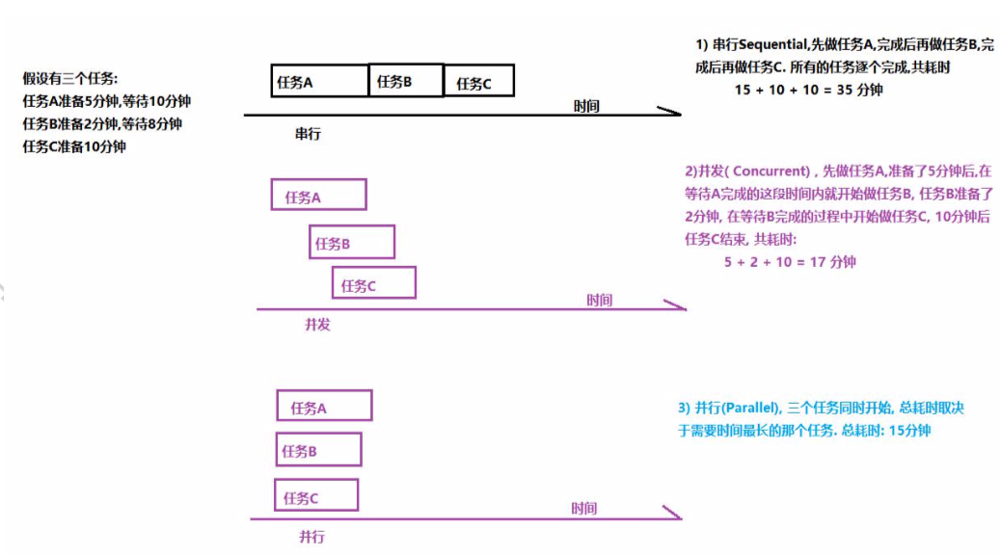
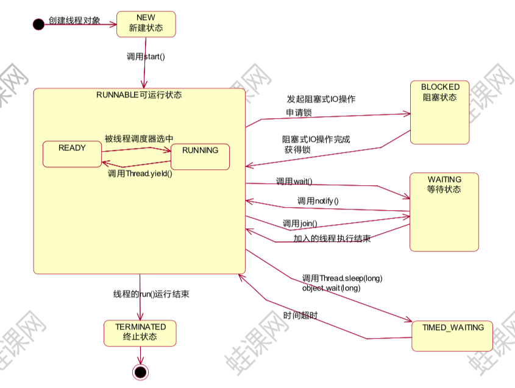

# 第一天 Java多线程

## 1 线程概述 

### 1.1 线程相关概念

#### 进程

​	进程(Process)是计算机中的程序关于某数据集合上的一次运行活动,是操作系统进行资源分配与调度的基本单位.

​	可以把进程简单的理解为正在操作系统中运行的一个程序. 

#### 线程

​	线程(thread)是进程的一个执行单元.
​	一个线程就是进程中一个单一顺序的控制流, 进程的一个执行分支
​	进程是线程的容器,一个进程至少有一个线程.一个进程中也可以有多个线程.
​	在操作系统中是以进程为单位分配资源,如虚拟存储空间,文件描 述符等. 每个线程都有各自的线程栈,自己的寄存器环境,自己的线程本地存储.

#### 主线程与子线程

​	JVM 启动时会创建一个主线程,该主线程负责执行main方法. 主线程就是运行 main 方法的线程
​	Java 中的线程不孤立的,线程之间存在一些联系. 如果在 A 线程中创建了B线程, 称B线程为A线程的子线程, 相应的A线程就是B线程的父线程

#### 串行,并发与并行



​	并发可以提高以事物的处理效率, 即一段时间内可以处理或者完成更多的事情.
​	并行是一种更为严格,理想的并发
​	从硬件角度来说, 如果单核 CPU,一个处理器一次只能执行一个线程的情况下,处理器可以使用时间片轮转技术 ,可以让 CPU 快速的在 各个线程之间进行切换, 对于用来来说,感觉是三个线程在同时执行. 如果是多核心 CPU,可以为不同的线程分配不同的 CPU 内核.        

### 1.2 线程的创建与启动

​	在 Java 中,创建一个线程就是创建一个 Thread 类(子类)的对象(实例).
​	Thread 类有两个常用的构造方法:Thread()与Thread(Runnable).对应的创建线程的两种方式:
​	定义 Thread 类的子类
​	定义一个 Runnable 接口的实现类

​	这两种创建线程的方式没有本质的区别

```java
package com.horse.createthread.p1;

/**
 * @Description 1)定义类继承 Thread
 * @Author Mr.Horse
 * @Date 2021/2/26
 */
public class MyThread extends Thread{
    //2) 重写 Thread 父类中的 run()
    // run()方法体中的代码就是子线程要执行的任务
    @Override
    public void run() {
        System.out.println("这是子线程需要打印的内容");
    }
}

//---------------------------------------------------------------------------------------

package com.horse.createthread.p1;

/**
 * @Description
 * @Author Mr.Horse
 * @Date 2021/2/26
 */
public class Test {
    public static void main(String[] args) {
        System.out.println("JVM启动main线程,main线程执行main方法");

        //3)创建子线程对象
        MyThread myThread = new MyThread();
        //4)启动线程
        myThread.start();

        /*
            调用线程的start()方法来启动线程, 启动线程的实质就是请求JVM运行相应的线程,这个线程具体在什么时候运行由线程调度器(Scheduler)决定
            注意:
            start()方法调用结束并不意味着子线程开始运行
            新开启的线程会执行run()方法
            如果开启了多个线程,start()调用的顺序并不一定就是线程启动的顺序
                    多线程运行结果与代码执行顺序或调用顺序无关
        */
        System.out.println("main线程后面其他的代码...");
    }
}
```

* Runnable接口

```java
package com.horse.createthread.p2;

/**
 * @Description
 * @Author Mr.Horse
 * @Date 2021/2/26
 */

/**
 * 当线程类已经有父类了,就不能用继承 Thread 类的形式创建线程,可以使用实现 Runnable 接口的形式
 *  1)定义类实现 Runnable 接口
 */
public class MyRunnable implements Runnable{
    //2)重写 Runnable 接口中的抽象方法 run(), run()方法就是子线程要执行的代码
    @Override
    public void run() {
        for(int i=0; i<=1000; i++) {
            System.out.println("sub thread->" + i);
        }
    }
}

//---------------------------------------------------------------------------------------

package com.horse.createthread.p2;

/**
 * @Description
 * @Author Mr.Horse
 * @Date 2021/2/26
 */
public class Test {
    public static void main(String[] args) {
        //3)创建 Runnable 接口的实现类对象
        MyRunnable runnable = new MyRunnable();
        //4)创建线程对象
        Thread thread = new Thread(runnable);
        //5)开启线程
        thread.start();

        //当前是 main 线程
        for(int i=0; i <= 1000; i++) {
            System.out.println("main==>" + i);
        }

        //有时调用 Thread(Runnable)构造方法时,实参也会传递匿名内部类对象
        new Thread(new Runnable() {
            @Override
            public void run() {
                for(int i=0; i<=1000; i++) {
                    System.out.println("sub -------> " + i);
                }
            }
        }).start();
    }
}
```


### 1.3 线程的常用方法 

#### 1.3.1 currentThread()方法

​	Thread.currentThread()方法可以获得当前线程
​	Java中的任何一段代码都是执行在某个线程当中的. 执行当前代码的线程就是当前线程.
​	同一段代码可能被不同的线程执行,因此当前线程是相对 的,Thread.currentThread()方法的返回值是在代码实际运行时候的线程对象。

```java
package com.horse.threadmethod.p1currentmethod;

/**
 * @Description
 * @Author Mr.Horse
 * @Date 2021/2/26
 */

/**
 * 定义线程类
 *      分别在构造方法中和run方法中打印当前线程
 */
public class SubThread1 implements Runnable{

    public SubThread1() {
        System.out.println("构造方法打印当前线程的名称:" + Thread.currentThread().getName());
    }

    @Override
    public void run() {
        System.out.println("run方法打印当前线程名称:" + Thread.currentThread().getName());
    }
}

//---------------------------------------------------------------------------------------

package com.horse.threadmethod.p1currentmethod;

/**
 * @Description 测试当前线程
 * @Author Mr.Horse
 * @Date 2021/2/26
 */
public class Test01CurrentThread {
    public static void main(String[] args) {
        System.out.println("main方法中打印当前线程: " + Thread.currentThread().getName());
        //创建子线程, 调用SubThread1()构造方法, 在main线程中调用构造方法,所以构造方法中的当前线程就是main线程
        Thread subThread = new Thread(new SubThread1());
//        subThread.start();  //启动子线程,子线程会调用run()方法,所以run()方法中的当前线程就是Thread-0子线程
        subThread.run();    //在 main方法中直接调用run()方法,没有开启新的线程,所以在run方法中的当前线程就是main线程

    }
}

//---------------------------------------------------------------------------------------

package com.horse.threadmethod.p1currentmethod;

/**
 * @Description 当前线程的复杂案例
 * @Author Mr.Horse
 * @Date 2021/2/26
 */
public class SubThread2 extends Thread {
    public SubThread2() {
        System.out.println("构造方法中,Thread.currentThread().getname(): " + Thread.currentThread().getName());
        System.out.println("构造方法,this.getName():" + this.getName());
    }

    @Override
    public void run() {
        System.out.println("run方法中,Thread.currentThread().getname(): " + Thread.currentThread().getName());
        System.out.println("run方法,this.getName():" + this.getName());
    }
}

//---------------------------------------------------------------------------------------

package com.horse.threadmethod.p1currentmethod;

/**
 * @Description
 * @Author Mr.Horse
 * @Date 2021/2/26
 */
public class Test02CurrentThread {
    public static void main(String[] args) throws InterruptedException {
        SubThread2 t = new SubThread2();
        t.setName("t1");    //设置当前线程名称
        t.start();

        Thread.sleep(1000);

        //Thread(Runnable)构造方法形参是 Runnable 接口,调用时传递的实参是接口的实现类对象
        Thread t2 = new Thread(t);
        t2.start();

        /**
         * 构造方法中,Thread.currentThread().getname(): main
         * 构造方法,this.getName():Thread-0
         * run方法中,Thread.currentThread().getname(): t1
         * run方法,this.getName():t1
         * run方法中,Thread.currentThread().getname(): Thread-1
         * run方法,this.getName():t1
         */
    }
}
```

#### 1.3.2 setName()/getName()

​	thread.setName(线程名称), 设置线程名称 

​	thread.getName()返回线程名称 

​	通过设置线程名称,有助于程序调试,提高程序的可读性, 建议为每个线程都设置一个能够体现线程功能的名称

#### 1.3.3 isAlive()

​	thread.isAlive()判断当前线程是否处于活动状态 

​	活动状态就是线程已启动并且尚未终止

```java
package com.horse.threadmethod.p2IsAlive;

/**
 * @Description
 * @Author Mr.Horse
 * @Date 2021/2/26
 */
public class SubThread extends Thread{
    @Override
    public void run() {
        System.out.println("run方法.isalive=" + this.isAlive());
    }
}

//---------------------------------------------------------------------------------------

package com.horse.threadmethod.p2IsAlive;

/**
 * @Description 测试当前线程的活动状态
 * @Author Mr.Horse
 * @Date 2021/2/26
 */
public class Test {
    public static void main(String[] args) {
        SubThread subThread = new SubThread();
        System.out.println("begin ==" + subThread.isAlive());   //false,在启动线程之前

        subThread.start();
        System.out.println("end ==" + subThread.isAlive());
        //结果不一定,打印这一行时,如果subThread线程还没结束就返回true,如果subThread线程已结束,就返回false
    }
}

```

####  1.3.4 sleep()

​	Thread.sleep(millis); 让当前线程休眠指定的毫秒数

​	当前线程是指 Thread.currentThread()返回的线程

```java
package com.horse.threadmethod.p3sleep;

/**
 * @Description 子线程休眠
 * @Author Mr.Horse
 * @Date 2021/2/26
 */
public class SubThread extends Thread {

    @Override
    public void run() {
        try {
            System.out.println("run, threadname=" + Thread.currentThread().getName() +
                    ",begin=" + System.currentTimeMillis());

            Thread.sleep(2000); //当前线程睡眠 2000 毫秒

            System.out.println("run, threadname=" + Thread.currentThread().getName() +
                    ",end=" + System.currentTimeMillis());
        }catch (InterruptedException e) {
            //在子线程的run方法中, 如果有受检异常(编译时异常)需要处理,只有选择捕获处理,不能抛出处理
            e.printStackTrace();
        }
    }
}

//---------------------------------------------------------------------------------------

package com.horse.threadmethod.p3sleep;
/**
 * @Description
 * @Author Mr.Horse
 * @Date 2021/2/26
 */
public class Test {
    public static void main(String[] args) {
        SubThread thread = new SubThread();
        System.out.println("main__begin: " + System.currentTimeMillis());

        thread.start();
        /**
         * 返回结果:
         *      main__begin: 1614325531094
         *      main__end: 1614325531095
         *      run, threadname=Thread-0,begin=1614325531095
         *      run, threadname=Thread-0,end=1614325533098
         */

//        thread.run();   //在 main 线程中调用实例方法 run(),没有开启新的线程
        /**
         * 返回结果:
         *      main__begin: 1614325467212
         *      run, threadname=main,begin=1614325467212
         *      run, threadname=main,end=1614325469217
         *      main__end: 1614325469217
         */

        System.out.println("main__end: " + System.currentTimeMillis());
    }
}

//---------------------------------------------------------------------------------------

package com.horse.threadmethod.p3sleep;

/**
 * @Description 使用线程休眠 Thread.sleep 完成一个简易的计时器
 * @Author Mr.Horse
 * @Date 2021/2/26
 */
public class SimpleTimer {
    public static void main(String[] args) {
        int remaining = 10;

        if(args.length == 1) {
            remaining = Integer.parseInt(args[0]);
        }

        while (true) {
            System.out.println("remaining:" + remaining);
            remaining --;
            if(remaining < 0) {
                break;
            }

            try {
                Thread.sleep(1000); //线程休眠
            }catch (InterruptedException e) {
                e.printStackTrace();
            }
        }
        System.out.println("Done");
    }
}
```

#### 1.3.5 getId()

thread.getId()可以获得线程的唯一标识 注意:
某个编号的线程运行结束后,该编号可能被后续创建的线程使 用
重启的 JVM 后,同一个线程的编号可能不一样

```java
package com.horse.threadmethod.p4getid;

/**
 * @Description
 * @Author Mr.Horse
 * @Date 2021/2/26
 */
public class SubThread extends Thread{
    @Override
    public void run() {
        System.out.println("thread.getName()=" + Thread.currentThread().getName() +
                ",id=" + Thread.currentThread().getId());
    }
}

//---------------------------------------------------------------------------------------

package com.horse.threadmethod.p4getid;

/**
 * @Description
 * @Author Mr.Horse
 * @Date 2021/2/26
 */
public class Test {
    public static void main(String[] args) {
        System.out.println(Thread.currentThread().getName() + ",id= " +
                Thread.currentThread().getId());

        //子线程的id
        for(int i=0; i<5; i++) {
            SubThread t = new SubThread();
            t.start();
            try {
                Thread.sleep(100);
            } catch (InterruptedException e) {
                e.printStackTrace();
            }
        }
    }
}
```


#### 1.3.6 yield()

​	Thread.yield()方法的作用是放弃当前的 CPU 资源,

```java
package com.horse.threadmethod.p5yield;

/**
 * @Description 线程让步
 * @Author Mr.Horse
 * @Date 2021/2/26
 */
public class SubThread extends Thread{
    @Override
    public void run() {
        long begin = System.currentTimeMillis();
        long sum = 0;
        for(int i = 0; i < 10000000; i++) {
            sum += i;
            Thread.yield();     //线程让步,放弃CPU执行权
        }

        long end = System.currentTimeMillis();
        System.out.println("用时:" + (end - begin));

    }
}

//---------------------------------------------------------------------------------------

package com.horse.threadmethod.p5yield;

/**
 * @Description
 * @Author Mr.Horse
 * @Date 2021/3/1
 */
public class Test {
    public static void main(String[] args) {
        //开启子线程,计算累加和
        SubThread thread = new SubThread();
        thread.start();

        //在 main 线程中计算累加和
        long begin = System.currentTimeMillis();
        long sum = 0;
        for(int i = 0; i < 10000000; i++) {
            sum += i;
            Thread.yield();     //线程让步,放弃CPU执行权
        }

        long end = System.currentTimeMillis();
        System.out.println("main线程用时:" + (end - begin));
    }
}
```


#### 1.3.7 setPriority()

​	**thread.setPriority(num); 设置线程的优先级**
​	java 线程的优先级取值范围是 1 ~ 10 , 如果超出这个范围会抛出 异常 IllegalArgumentException.
​	在操作系统中,优先级较高的线程获得 CPU 的资源越多
​	线程优先级本质上是只是给线程调度器一个提示信息,以便于调 度器决定先调度哪些线程. 注意不能保证优先级高的线程先运行.

​	Java 优先级设置不当或者滥用可能会导致某些线程永远无法得到 运行,即产生了线程饥饿.
​	线程的优先级并不是设置的越高越好,一般情况下使用普通的优 先级即可,即在开发时不必设置线程的优先级
​	线程的优先级具有继承性, 在 A 线程中创建了 B 线程,则 B 线程的 优先级与 A 线程是一样的.

```java
package com.horse.threadmethod.p6priority;

/**
 * @Description
 * @Author Mr.Horse
 * @Date 2021/3/1
 */
public class ThreadA extends Thread {
    @Override
    public void run() {
        long begin = System.currentTimeMillis(); long sum = 0 ;
        for(long i = 0 ; i<= 10000000000L; i++){
            sum += i; }
        long end = System.currentTimeMillis();
        System.out.println("thread a : " + (end - begin));
    }
}

//---------------------------------------------------------------------------------------

package com.horse.threadmethod.p6priority;

/**
 * @Description
 * @Author Mr.Horse
 * @Date 2021/3/1
 */
public class ThreadB extends Thread {
    @Override
    public void run() {
        long begin = System.currentTimeMillis(); long sum = 0 ;
        for(long i = 0 ; i<= 10000000000L; i++){
            sum += i; }
        long end = System.currentTimeMillis();
        System.out.println("thread b : " + (end - begin));
    }
}

//---------------------------------------------------------------------------------------

package com.horse.threadmethod.p6priority;

/**
 * @Description
 * @Author Mr.Horse
 * @Date 2021/3/1
 */
public class Test {
    public static void main(String[] args) {
        ThreadA threadA = new ThreadA();
        threadA.setPriority(1);
        threadA.start();

        ThreadB threadB = new ThreadB();
        threadB.setPriority(10);
        threadB.start();
    }
}

```

#### 1.3.8 interrupt()

​	中断线程.
​	注意调用 interrupt()方法仅仅是在当前线程打一个停止标志,并不是真正的停止线程

```java
package com.horse.threadmethod.p7interrupt;

/**
 * @Description
 * @Author Mr.Horse
 * @Date 2021/3/1
 */
public class SubThread extends Thread {
    @Override
    public void run() {
        for(int i=0; i<10000; i++) {
            //判断线程的中断标志,线程有 isInterrupted()方法,该 方法返回线程的中断标志
            if(this.isInterrupted()) {
//                break;
                return; //结束当前循环
            }

            System.out.println("sub-->" + i);
        }
    }
}

//---------------------------------------------------------------------------------------

package com.horse.threadmethod.p7interrupt;

/**
 * @Description
 * @Author Mr.Horse
 * @Date 2021/3/1
 */
public class Test {
    public static void main(String[] args) {
        SubThread thread = new SubThread();
        thread.start(); //开启子线程

        //当前线程是 main 线程
        for(int i = 0; i < 100; i++) {
            System.out.println("main run ==> " + i);
        }

        //中断子线程,但是仅仅是给子线程标记中断
        thread.interrupt();
    }
}
```


#### 1.3.9 setDaemon()

​	Java 中的线程分为用户线程与守护线程
​	守护线程是为其他线程提供服务的线程,如垃圾回收器(GC)就是一 个典型的守护线程
​	守护线程不能单独运行, 当JVM中没有其他用户线程,只有守护线程时,守护线程会自动销毁, JVM 会退出

```java
package com.horse.threadmethod.p8daemon;

/**
 * @Description
 * @Author Mr.Horse
 * @Date 2021/3/1
 */
public class SubThread extends Thread {
    @Override
    public void run() {
        while(true) {
            System.out.println("sub Thread...");
        }
    }
}

//---------------------------------------------------------------------------------------

package com.horse.threadmethod.p8daemon;

/**
 * @Description
 * @Author Mr.Horse
 * @Date 2021/3/1
 */
public class Test {
    public static void main(String[] args) {
        SubThread thread = new SubThread();
        //设置线程为守护线程
        thread.setDaemon(true); //设置守护线程的代码应该在线程启动之前
        thread.start();

        //当前线程为main线程
        for(int i=0; i<=10; i++) {
            System.out.println("main==>" + i);
        }
        //当main线程结束, 守护线程thread也销毁了
    }
}
```


#### 1.4 线程的生命周期

​	线程的生命周期是线程对象的生老病死,即线程的状态
​	线程生命周期可以通过 getState()方法获得, 线程的状态是 

​	**Thread.State 枚举类型定义的, 由以下几种:**

* NEW,新建状态. 创建了线程对象,在调用 start()启动之前的状态
* RUNNABLE,可运行状态. 它是一个复合状态,包含:READY和RUNNING 两个状态. READY 状态该线程可以被线程调度器进行调度使 它处于 RUNNING 状态, RUNING 状态表示该线程正在执行. Thread.yield()方法可以把线程由 RUNNING 状态转换为 READY 状态
* BLOCKED 阻塞状态.线程发起阻塞的 I/O 操作,或者申请由其他线程 占用的独占资源,线程会转换BLOCKED 阻塞状态. 处于阻塞状态的线程不会占用CPU资源. 当阻塞I/O操作执行完,或者线程获得了其申请的资源,线程可以转换为 RUNNABLE.
* WAITING 等待状态. 线程执行了 object.wait(), thread.join()方法会把线程转换为WAITING等待状态, 执行 object.notify()方法,或者加入的线程执行完毕,当前线程会转换为 RUNNABLE 状态
* TIMED_WAITING 状态,与WAITING状态类似,都是等待状态.区别在于处于该状态的线程不会无限的等待,如果线程没有在指定的时间范围内完成期望的操作,该线程自动转换为 RUNNABLE
* TERMINATED终止状态,线程结束处于终止状态
          




### 1.5 多线程编程的优势与存在的风险

**多线程编程具有以下优势:**
	1) 提高系统的吞吐率(Throughout). 多线程编程可以使一个进程，有多个并发(concurrent,即同时进行的)的操作
	2) 提高响应性(Responsiveness).Web 服务器会采用一些专门的线程负责用户的请求处理,缩短了用户的等待时间
	3) 充分利用多核(Multicore)处理器资源. 通过多线程可以充分的利用 CPU 资源

**多线程编程存在的问题与风险:**
	1) 线程安全(Thread safe)问题.多线程共享数据时,如果没有采取正确的并发访问控制措施,就可能会产生数据一致性问题,如读取脏数 据(过期的数据), 如丢失数据更新.
	2) 线程活性(thread liveness)问题.由于程序自身的缺陷或者由资 源稀缺性导致线程一直处于非 RUNNABLE 状态,这就是线程活性问题, 常见的活性故障有以下几种:
		(1) 死锁(Deadlock). 类似鹬蚌相争.
		(2) 锁死(Lockout), 类似于睡美人故事中王子挂了
		(3) 活锁(Livelock). 类似于小猫咬自己尾巴
		(4) 饥饿(Starvation).类似于健壮的雏鸟总是从母鸟嘴中抢到食物.
	3) 上下文切换(Context Switch). 处理器从执行一个线程切换到执行另外一个线程
	4) 可靠性. 可能会由一个线程导致 JVM 意外终止,其他的线程也无法执行.